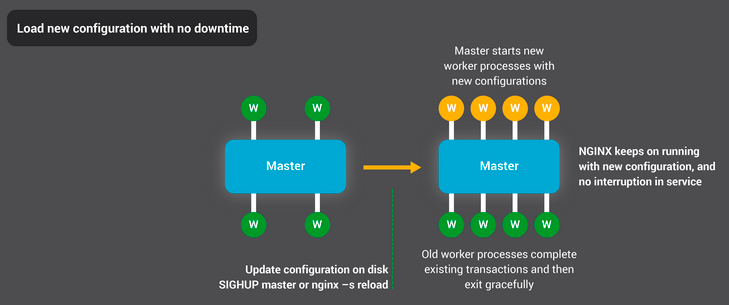

# NGINX

## Задача Frontend серверов

Первое звено на серверной стороне, которое и начинает обработку запроса. Как правило, это легкие и быстрые веб-сервера,
практически не занимающиеся вычислениями. Программное обеспечение фронтенда принимает запрос, далее, если может, то
сразу отвечает на него, иначе проксирует запрос к бэкенду. На Front End обычно ложатся задачи не требующие никаких
бизнес-вычислений.

#### Отдача статики

Под статикой подразумевается JavaScript / CSS / HTML / Fonts – данные для рендеринга web-страниц. Так Frontend может
отдавать картинки, видео и другой статический объемный контент.

Пример: [static](example/static).

#### Балансировка

При приходе запроса на Frontend он передает данные на некоторый из N Backend, прописанных у него в настройках. Обычно
Backend для обработки запроса ищется по алгоритму Round-Robin, но есть и умные Frontend, учитывающие текущую загрузку
Backend.

Пример: [balancing](example/balancing).

#### Кэширование

Frontend можно использовать как промежуточный кэширующий сервер, ускоряющий обработку однотипных запросов. Для
корректной работы кэшей нужно корректно настроить ключ: как правилос смесь URI и GET-параметров или Cookie, и политику
работы кэшей, основанную на некоторых данных от сервера. Чаще всего для этого используют заголовок Cache-Control.

Пример: [caching](example/caching).

## NGINX

Рассмотрим nginx как один из наиболее удачных реализаций легковесных серверов для Frontend.



У nginx есть один главный и несколько рабочих процессов. Основная задача главного процесса — чтение и проверка
конфигурации и управление рабочими процессами (главный процесс запускается от имени суперпользователя выполняет такие
операции, как чтение конфигурации и открытие портов). Рабочие процессы выполняют фактическую обработку запросов. nginx
использует модель, основанную на событиях, и зависящие от операционной системы механизмы для эффективного распределения
запросов между рабочими процессами. Количество рабочих процессов задаётся в конфигурационном файле и может быть
фиксированным для данной конфигурации или автоматически устанавливаться равным числу доступных процессорных ядер.

```shell
nginx -s <signal> stop/quit/reload/reopen
```

* stop - принудительное завершение;
* quit - воркеры завершают обслуживание текущих задач и завершаются;
* reload - перезагрузка конфигурации;
* reopen - переоткрытие конфигурационного файла.

При перезагрузке конфигурации (reload) master-процесс валидирует ее, после этого посылает команду рабочим процессам
завершиться. Рабочие процессы в свою очередь заканчивают принимать новые соединения и завершают обслуживание текущих,
после чего завершаются.

Конфигурационный файл делится на блоки:

```
{
    events {}
    http {
        # Блок server должен различаться по портам (listen) и имени сервера (server_name).
        server {
            listen      80
            server_name *.example.com
            
            # Блок location задаёт regexp префикса, который сравнивается с URI из запроса.
            # Для подходящих запросов добавлением URI к пути, указанному в директиве root,
            # получается путь к запрашиваемому файлу в локальной файловой системе.
            # Если есть совпадение с несколькими блоками location, nginx выбирает блок с самым длинным префиксом.
            location / {
                root	/var/www
            }
        }
    }
}
```

Блок location поддерживает проверку uri по следующим правилам:

* `~*`- case-insensitive сравнение;
* `~` - case-sensitive сравнение;
* `=` - точное совпадение uri и location;
* `^~`  - regexp не проверяется.

Сначала nginx ищет среди всех префиксных location, заданных строками, максимально совпадающий, после проверяет location,
заданные регулярными выражениями, в порядке их следования в конфигурационном файле. При первом же совпадении поиск
прекращается и nginx использует совпавший location. Если запросу не соответствует ни одно из регулярных выражений, nginx
использует максимально совпавший префиксный location, найденный ранее.

Директива index определяет файлы, которые будут использоваться в качестве индекса. Необходимо иметь в виду, что при
использовании индексного файла делается внутреннее перенаправление и запрос может быть обработан уже в другом location.
Например, в такой конфигурации:

```
location = / {
    index index.html;
}

location / {
    root /var/www
}
```

запрос `/` будет фактически обработан во втором `location` как `/index.html`.

`try_files` проверяет существование файлов в заданном порядке и использует для обработки запроса первый найденный файл,
причём обработка делается в контексте этого же `location`. Путь к файлу строится из параметра файл в соответствии с
директивами root.

```
location @tomcat { 
    proxy_pass http://127.0.0.1:8080; 
} 

location / {
    try_files /maintenance.html $uri @tomcat;
}
```

В случае, если ничего не найдено, можно выдавать код ошибки:

```
location / {
    try_files $uri $uri/ =404; 
}
```

Для ускорения работы с медленными клиентами используется буферизация. При использовании буферов nginx какое-то время
хранит ответ полученный от бекэнд сервера и потом отправляет его клиенту. Если клиент не достаточно быстр, то nginx
закрывает соединение с бекэнд-сервером

#### Балансировка

```shell
upstream backend {
    server localhost:8081 
    server localhost:8082 
}

location / {
    proxy_set_header Host $host;
    proxy_set_header X-Real-IP $remote_addr;
    proxy_pass http://backend;
}
```

`upstream` описывает группу серверов для балансировки. По умолчанию соединения распределяются по серверам циклически (в
режиме Round-Robin) с учётом весов серверов. Если при попытке работы с сервером происходит ошибка, то соединение
передаётся следующему серверу, и так далее до тех пор, пока не будут опробованы все работающие серверы. Если связь с
серверами не удалась, соединение будет закрыто.

`server` задаёт адрес в виде доменного имени или ip-адреса и другие параметры сервера.

Параметры:

* `weight` – вес сервера, по умолчанию 1;
* `max_conns` – ограничивает максимальное число одновременных соединений к проксируемому серверу;
* `max_fails` – задаёт число неудачных попыток работы с сервером, которые должны произойти в течение времени, заданного
  параметром `fail_timeout`, чтобы сервер считался недоступным на период времени, также заданный параметром
  fail_timeout. По умолчанию число попыток устанавливается равным 1. Нулевое значение отключает учёт попыток. В данном
  случае неудачной попыткой считается ошибка или таймаут при установке соединения с сервером;
* `fail_timeout` – задаёт время, в течение которого должно произойти заданное число неудачных попыток работы с сервером
  для того, чтобы сервер считался недоступным; и время, в течение которого сервер будет считаться недоступным. По
  умолчанию параметр равен 10 секундам;
* `backup` – помечает сервер как запасной сервер. На него будут передаваться соединения в случае, если не работают
  основные серверы.

Типы балансировки:

* `round-robin` – сервера выбираются по очереди, используется по-умолчанию;
* `ip_hash` – соответствие клиента серверу определяется при помощи хэшированного значения ключа, используется для
  поддержания сессий;
* `least_conn` – каждое новое соединение будет передано тому серверу, у которого на данный момент меньше всего активных
  соединений: такой подход полезен если приложение часто использует постоянные соединения;
* `least_time` – каждое новое соединение будет передано серверу с наименьшими средним временем ответа и числом активных
  соединений с учётом весов серверов.

Так же можно использовать health check для серверов. По умолчанию при проверке работоспособности проверяется только
возможность установки соединения, но можно настроить проверку данных, получаемых от сервера.

## Мастабирование Frontend серверов

Для масштабирования Frontend обычно используется DNS-балансировка. Т.е. запрос приходит на hostname, а DNS в свою
очередь резолвит этот hostname в IP-адрес одного из Frontend серверов. Для обеспечения отказоустойчивости берутся два
сервера - основной и дублирующий, на каждом имеется два сетевых интерфейса. Внешние интерфейсы имеют одинаковые
IP-адреса, но на дублирующем Frontend он выключен. Вторым сетевым интерфейсом они смотрят друг на друга. В случае, если
основной сервер выходит из строя, дублирующий поднимает внешний IP-адрес и принимает обработку запросов на себя.

## Литература

1. [Beginner's Guide](http://nginx.org/en/docs/beginners_guide.html)
1. [Server names](http://nginx.org/en/docs/http/server_names.html)
1. [How nginx processes a request](https://nginx.org/en/docs/http/request_processing.html)
1. [Configuring HTTPS servers](https://nginx.org/en/docs/http/configuring_https_servers.html)
1. [A Guide to Caching with NGINX and NGINX Plus](https://www.nginx.com/blog/nginx-caching-guide/)
1. [Разбираемся в HTTP прокси NGINX, балансировке нагрузки, буферизации и кешировании](https://devacademy.ru/article/razbiraemsya-v-http-proksi-nginx-balansirovke-nagruzki-buferizatsii-i-keshirovanii/)