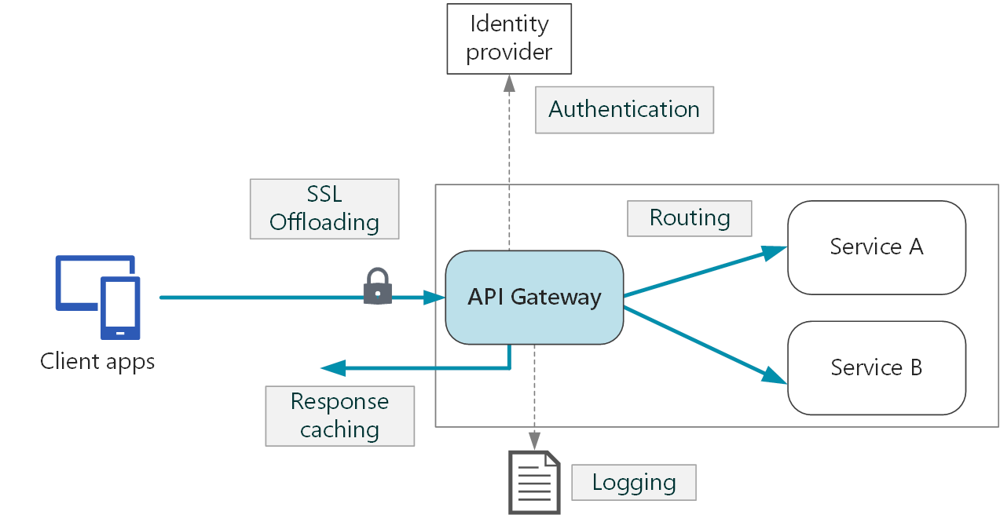
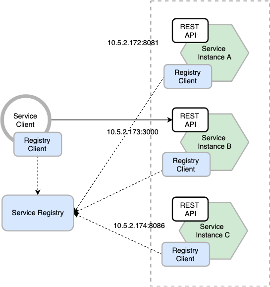
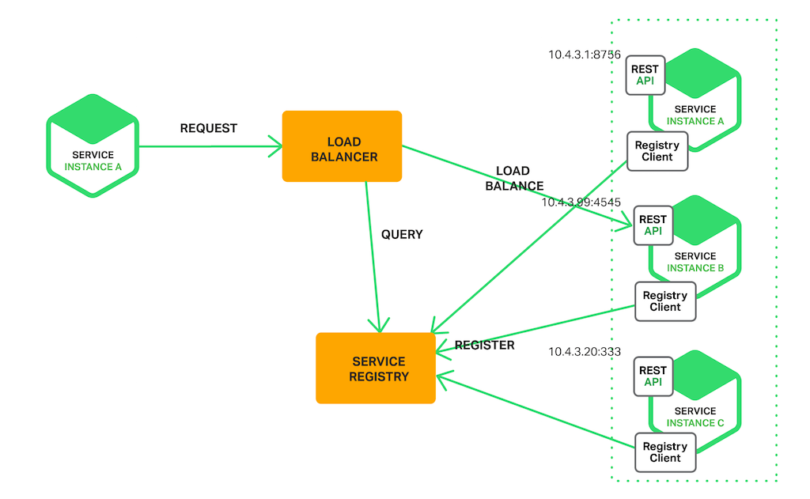
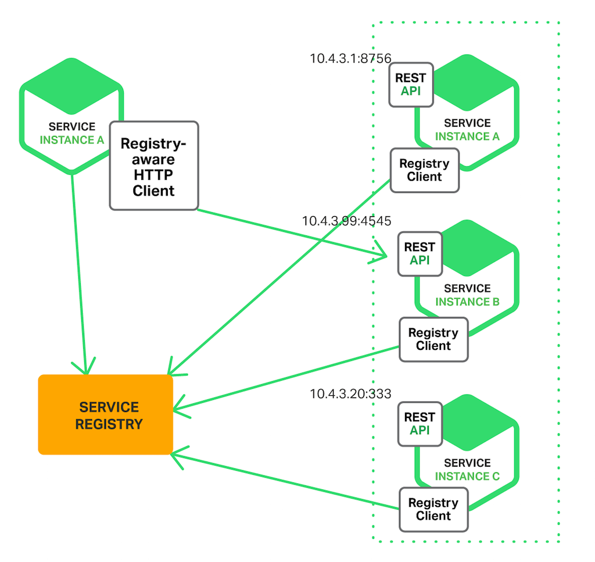
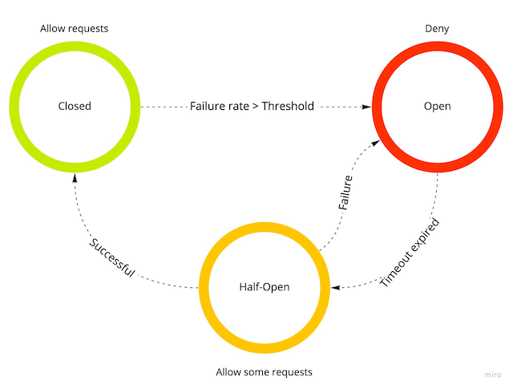
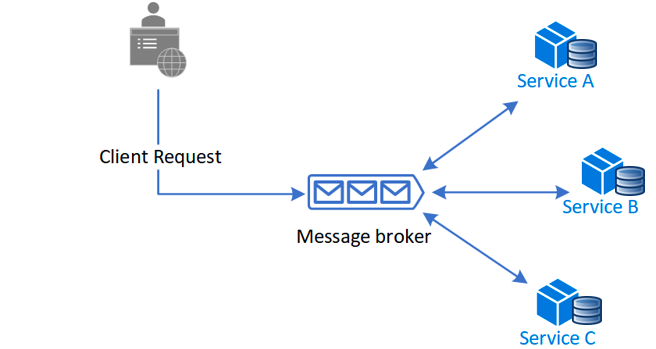
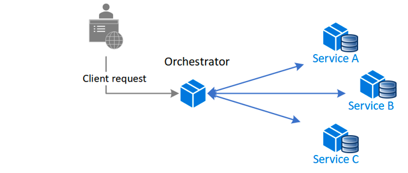
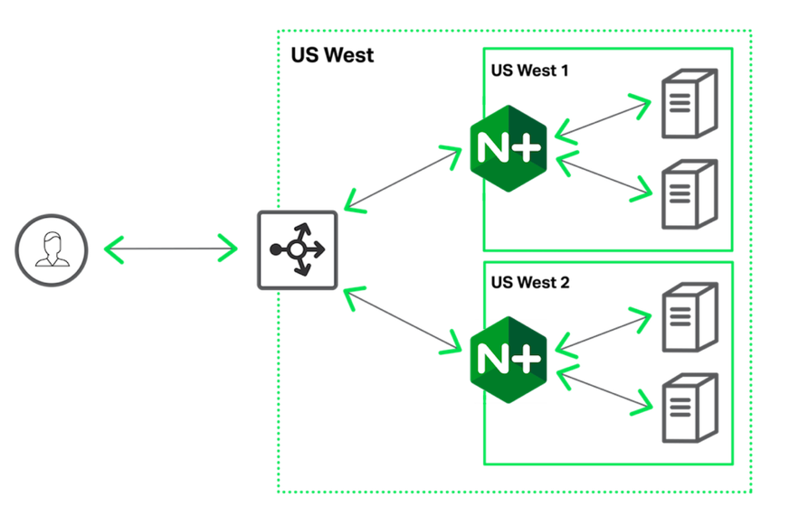
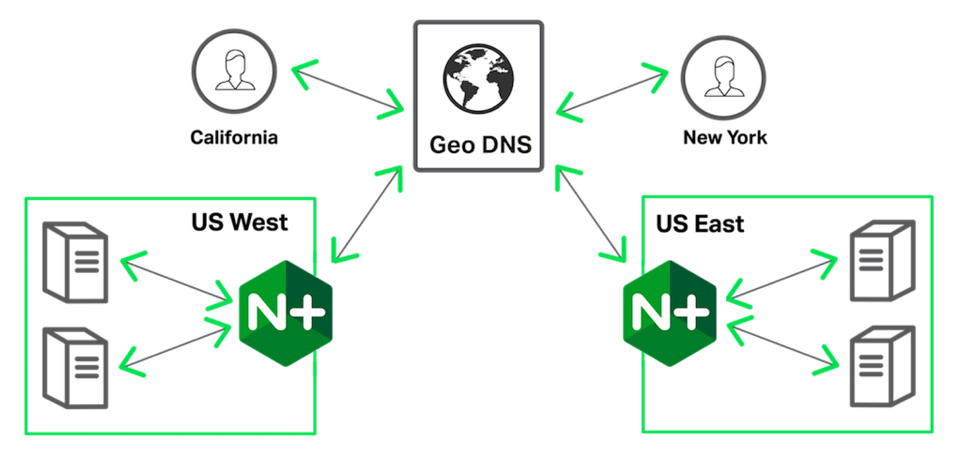

# Архитектруные паттерны

## Gateway API

Шлюз API находится между клиентами и службами, он выполняет функцию обратного прокси, передавая запросы от клиентов к
сервисам. Также он может выполнять такие специализированные задачи, как аутентификация, SSL-терминация и rate limiting (
ограничение числа запросов).

Для публичных сервисов есть ряд задач, которые они должны уметь решать:

* SSL-termination.
* Аутентификация.
* Back-List и White-List IP адресов.
* Rate Limit.
* Request Logging, Monitoring.
* Кэширование ответов, GZIP для сжатия ответов, отдача статики.

Функции Gateway API можно сгруппировать в соответствии со следующими задачами:

##### Gateway Routing

Использование шлюза в качестве обратного прокси-сервера для перенаправления запросов на одну или несколько сервисов с
помощью маршрутизации L7. Шлюз предоставляет одну конечную точку для клиентов и позволяет разделить клиенты и сервисы.

##### Aggregation Gateway

Использование шлюза для объединения нескольких отдельных запросов в один. Этот шаблон применяется, если необходимо
выполнить одну операцию вызова к нескольким сервисам. Клиент отправляет один запрос к шлюзу, этот шлюз распределяет
запросы между разными сервисами, затем объединяет результаты и отправляет их запрашивающему клиенту. Это позволяет
сократить число вызовов между клиентом и серверной частью.

##### Offloading Gateway

Использование шлюза для выполнения типовых операций, например аутентификации и авторизации.



## Service Discovery

Паттерн Service Discovery используется для получения информации об адресе сервиса по его имени. Две главных задачи,
решаемые этим паттерном:

1. Подключение нового экземпляра к текущему окружению.
2. Обнаружение отказов, т.к. задача Registry Service проверять доступность зарегистрированных приложений.



При старте приложения клиент знает адрес Registry Service и выполняет запрос на регистрацию, передавая свой ip,
hostname, health check и дополнительную инфомацию о себе. Для получения гарантии работоспособности инстансов приложений,
Registry Service должен знать какой сервис доступен в текущий момент времени. Этого можно достигнуть двумя путями:

1. Registry Service знает адреса и health check сервисов и самостоятельно контролирует их доступность. Это решение
   позволяет в кратчайшие сроки обнаружить недоступность сервиса, но требует накладных накладные расходы на выполнение
   Liveness Probe (запрос health check).
2. Каждый инстанс сам раз в интервал (~15-30 секунд) извещает Registry Service что он живой. Этот подход снижает
   нагрузку на Registry Service, но увеличивает время обнаружения отказов, т.к. при неполучении одного Heart Beat от
   инстанса нельзя с уверенностью сказать, что сервис недоступен или просто произошел сбой одного запроса. Обычно при
   таком решении инстанс убирается из балансировки, когда он не прислал уведомление 3 раза. Ускорить этот процесс можно
   если Registry Service при отсутствии первого Heart Beat сам выполнит запрос на проверку доступности, тем самым
   подвердив или опровергнув отказ экземпляра сервиса.

Информация о доступности сервисов обычно получается при запросе / ответе от Registry Service во время проверки
доступности инстансов.

Если экземпляров сервиса зарегистрировано больше одного, то возникает вопрос выбора на какой адрес сделать запрос.

#### Server Side Load Balancing



Клиент выполняет запрос к сервису через выделенный Load Balancer. Load Balancer получает актуальную информацию о
доступных инстансах сервиса и пробрасывает запрос к выбранному экземпляру. В качестве Load Balancer может выступать
Gateway API, но в такой архитектуре получится что это центральное связующее звено системы, что плохо с точки зрения
отказоустойчивости.

Здесь могут быть применены более сложные алгоримы балансировки:

* Round Robin with priority – сервера выбираются по очереди в соответствии со своим весом.
* Наименее загруженный сервис (по количеству соединений) – каждое новое соединение будет передано тому серверу, у
  которого на данный момент меньше всего активных соединений.
* Least Response Time – каждое новое соединение будет передано серверу с наименьшими средним временем ответа и числом
  активных соединений с учётом весов серверов.

#### Client‑Side Discovery



Каждый клиент от Registry Service раз в интервал Heart Beat получает актуальную информацию о доступных сервисах. На базе
этой информации он выбирает на какой сервис нужно выполнить запрос. Обычно в данном случае не делают сложную логику
выбора и использую Round Robin.

В данном случае нет дополнительного сервиса в виде Load Balancer, а значит меньше вероятность сбоя.

Но требуется реализовывать логику получения данных от Registry Service и балансировку запросов в каждом приложении, что
является сложной задачей, если не все севрисы написаны на одном языке.

## Circuit Breaker

Шаблон проектирования Circuit Breaker используется для устранения избыточной нагрузки на систему в случае недоступности
одной из его компонентов. В отличии от Retry паттерна, паттерн Circuit Breaker рассчитан на менее ожидаемые ошибки,
которые могут длиться намного дольше: обрыв сети, отказ сервиса, оборудования. В этих ситуациях при повторной попытке
отправить аналогичный запрос с большой долей вероятности мы получим аналогичную ошибку. Например, приложение
взаимодействует с неким сервисом, и в рамках реализации запросов и ответов предусмотрен некоторый timeout, по истечении
которого, если от сервиса не получен ответ, то операция считается не успешной. В случае проблем с этим сервисом, во
время ожидания ответа и до достижения timeout приложение может потреблять какие-то критически важные ресурсы (память,
процессорное время), которые скорее всего нужны другим частям приложения. В такой ситуации, для приложения будет
предпочтительнее завершить операцию с ошибкой сразу, не дожидаясь timeout от сервиса и повторять попытку только тогда,
когда вероятность успешного завершения будет достаточно высока.

Паттерн Circuit Breaker предотвращает попытки приложения выполнить операцию, которая скорее всего завершится неудачно,
что позволяет продолжить работу дальше не тратя важные ресурсы, пока известно, что проблема не устранена. Приложение
должно быстро принять сбой операции и обработать его. Он также позволяет приложению определять, была ли устранена
неисправность. Если проблема устранена, приложение может попытаться вызвать операцию снова.



У Circuit Breaker есть три состояния:

1. Closed: Запрос приложения перенаправляется на операцию. Прокси-сервер ведет подсчет числа недавних сбоев, и если
   вызов операции не завершился успешно, прокси-сервер увеличивает это число. Если число недавних сбоев превышает
   заданный порог в течение заданного периода времени, прокси-сервер переводится в состояние Открытый. На этом этапе
   прокси-сервер запускает таймер времени ожидания, и по истечении времени этого таймера прокси-сервер переводится в
   состояние Half-Open. Назначение таймера — дать сервису время для решения проблемы, прежде чем разрешить приложению
   попытаться выполнить операцию еще раз.
1. Open: запрос от приложения немедленно завершает с ошибкой и исключение возвращается в приложение.
1. Half-Open: Ограниченному числу запросов от приложения разрешено проходить через операцию и вызывать ее. Если эти
   запросы выполняются успешно, предполагается, что ошибка, которая ранее вызывала сбой, устранена, а автоматический
   выключатель переходит в состояние Closed и счетчик сбоев сбрасывается. Если какой-либо запрос завершается со сбоем,
   автоматическое выключение предполагает, что неисправность все еще присутствует, поэтому он возвращается в состояние
   Open и перезапускает таймер времени ожидания, чтобы дать системе дополнительное время на восстановление после сбоя.

Состояние Half-Open помогает предотвратить быстрый рост запросов к сервису. Т.к. после начала работы сервиса, некоторое
время он может быть способен обрабатывать ограниченное число запросов до полного восстановления.

Цель применения этого паттерна — дать системе время на исправление ошибки, которая вызвала сбой, прежде чем разрешить
приложению попытаться выполнить операцию еще раз. Шаблон Circuit Breaker обеспечивает стабильность, пока система
восстанавливается после сбоя и снижает влияние на производительность.

Приложение, вызывающее операцию через Circuit Breaker, должно быть подготовлено к обработке исключений, возникающих,
если операция недоступна. Способ обработки исключения будет зависеть от приложения, например, приложение может временно
использовать деградацию функциональности, вызвать альтернативную операцию для выполнения той же задачи или получения тех
же данных, взять данные из кэша, или сообщить об исключении пользователю и попросить его повторить попытку позже.

### SAGA

Шаблон проектирования Saga — это способ управления согласованностью данных между микросервисами в сценариях
распределенных транзакций. Saga — это последовательность транзакций, которая обновляет каждый сервис и публикует
сообщение или событие для активации следующего шага транзакции. Если шаг завершается ошибкой, Saga выполняет
компенсирующие транзакции, которые отменяют предыдущие транзакции.

Транзакция — это единая единица логики или работы, которая иногда состоит из нескольких операций. В рамках транзакции
событие — это изменение состояния, которое происходит с сущностью, а команда инкапсулирует всю информацию, необходимую
для выполнения действия или запуска последующего события.

Модель Database-Per-Service предоставляет множество архитектурных преимуществ. Инкапсуляция данных домена позволяет
каждому сервису использовать оптимальный тип хранилища данных и схему, масштабировать свое хранилище данных по мере
необходимости и изолировать от сбоев других сервисов. Тем не менее, обеспечение согласованности данных в базах данных,
относящихся к конкретному сервису, создает проблемы.

Для выполнения распределенных транзакций, таких как протокол двухфазной фиксации (2PC) , необходимо, чтобы все участники
транзакции зафиксировали или выполнили откат до того, как транзакция будет продолжена. Проблемы этого подхода в том, что
у нас появляется единая точка отказа.

В шаблонах Saga:

* Транзакции подлежащих компенсации — это транзакции, которые потенциально могут быть реверсированы путем обработки
  другой транзакции с противоположным результатом.
* Сводная Транзакция (Pivot Transaction) — это точка go/no-go в Saga. Если Сводная Транзакция фиксируется, Saga
  выполняется до завершения (свое рода точка невозврата). В роли Сводной Транзакции может быть транзакция (операция),
  которую нельзя повторить или отменить, либо это может быть последней из подлежащих компенсации транзакций или первой
  повторяемой транзакцией в Saga.
* Повторяемые Транзакции (Retryable Transactions) — это транзакции, которые следуют за транзакцией Сводной Транзакцией и
  гарантированно выполняются.

Существует два распространенных подхода к реализации Saga: Хореографическая и Оркетстрируемая. Каждый подход имеет
собственный набор проблем и технологий для координации рабочего процесса.

### Хореографическая Saga



##### Преимущества

* Хорошо подходит для простых рабочих процессов, требующих нескольких участников, и не требует логики координации.
* Не требует дополнительной реализации и обслуживания сервиса.
* Не вводит единую точку отказа, так как обязанности распределяются по участникам Saga.

##### Недостатки

* Рабочий процесс может стать запутанным при добавлении новых шагов, так как трудно отслеживать, какие участники Saga
  прослушивают команды.
* Существует риск циклической зависимости между участниками Saga, поскольку они должны использовать команды друг друга.
* Тестирование интеграции значительно усложняется.

### Оркестируемая Saga

Оркестрация — это способ координации, когда централизованный контроллер сообщает участникам Saga, какие локальные
транзакции следует выполнить. Saga Orchestrator обрабатывает все транзакции и сообщает участникам, какая операция должна
выполняться на основе событий. Orchestrator выполняет запросы Saga, сохраняет и интерпретирует состояния каждой задачи,
а также выполняет восстановление после сбоя с помощью компенсирующих транзакций.



##### Преимущества

* Хорошо подходит для сложных рабочих процессов, в которых участвуют многие участники или новые участники, добавленные с
  течением времени.
* Подходит, если существует контроль над каждым участником процесса и управление потоком действий.
* Не вводит циклические зависимости, так как все участники Saga зависят от Оркестратора.
* Участникам Saga не нужно знать о командах для других участников. Четкое разделение проблем упрощает бизнес-логику.

##### Недостатки

* Дополнительная сложность проектирования требует реализации логики координации.
* Есть дополнительная точка отказа, так как Оркестратора управляет полным рабочим процессом.

##### Проблемы и рекомендации

* Шаблон Saga может быть сложным, так как он требует решения, как координировать транзакцию и поддерживать
  согласованность данных для бизнес-процесса, охватывающего несколько микросервисов.
* Шаблон Saga особенно трудно отлаживать, и сложность растет по мере роста участников.
* Откат данных очень сложен, так как участники Saga зафиксируют изменения в своих локальных базах данных. И для каждой
  операции требуется реализовывать
* Реализация должна уметь обрабатывать набор потенциальных временных сбоев и предоставлять Идемпотентность для
  уменьшения побочных эффектов и обеспечения согласованности данных. Идемпотентность означает, что одна и та же операция
  может повторяться несколько раз, не изменяя первоначальный результат.
* Нужно делать полный мониторинг процесса работы Saga.
* Отсутствие изоляции данных участника накладывает проблемы с устойчивостью. Реализация Saga должна включать контрмеры
  для сокращения аномалий.

Могут возникать следующие проблемы:

* Потерянные обновления (Lost Updates), когда одна Saga записывается без чтения изменений, внесенных другой Saga.
* Грязное чтение (Dirty Reading), когда транзакция или Saga считывает обновления, сделанные другой Saga, которая еще не
  выполнила эти обновления.
* Нечеткие и неповторяемые операции чтения (Fuzzy/non-repeatable Reads), когда различные шаги Saga считывают различные
  данные, так как происходит обновление данных между операциями чтения.

Предлагаемые контрмеры для сокращения или предотвращения этих проблем включают:

* Семантическая блокировка (Semantic Lock), т.е. блокировка на уровне приложения, в которой транзакция, подлежащая
  компенсации, использует семафор для указания того, что обновление выполняется.
* Коммутативные обновления (Commutative Updates), т.е. обновления, которые могут выполняться в любом порядке и дают тот
  же результат.
* Пессимистическое представление (Pessimistic View): Один Saga может считывать "грязные" данные, в то время как другая
  Saga выполняет транзакцию для отката операции. Пессимистическое представление переупорядочивает Saga, чтобы базовые
  данные были обновлены в повторяемой транзакции, что исключает возможность некорректного чтения.
* Значение для повторного считывания (Reread Values) проверяет, что данные не изменились, а затем обновляет запись. Если
  запись была изменена, действия прерываются, и Saga может перезапуститься.
* В файл обновлений (Version File) записываются операции записи по мере их поступления, а затем они выполняются в
  правильном порядке.
* Разделение операций по уровню риска: запросы с низким риском используют Saga, а запросы с высоким риском применяют
  распределенные транзакции.

Используйте шаблон Saga, если вам нужно:

* Обеспечение согласованности данных в распределенной системе без тесной связи.
* Откат или компенсация при сбое одной из операций в последовательности.

Шаблон Saga менее подходит для:

* Тесно связанные транзакции.
* Компенсирующие транзакции, происходящие в предыдущих участниках.
* Циклические зависимости.

## High Availability





## Примеры

Для работы примера нужен OpenJDK 11 и Docker. Для Docker нужно выдать 4 CPU, 8Gb памяти, т.к. поднимается 10
контейнеров.

```shell
$ git clone --single-branch --branch circuit-breaker https://github.com/Romanow/micro-services-v2.git
$ cd micro-services-v2
# собираем проект 
$ ./gradlew clean build
# пакуем в Docker
$ docker compose build
# запускаем
$ docker compose up
# дождаться поднятия всех контейнеров
$ docker ps
CONTAINER ID   IMAGE          COMMAND                  CREATED         STATUS          PORTS                                                                                                                                                                                                      NAMES
9d43bcf7ca90   e9d16c70967f   "java -Dserver.port=…"   8 minutes ago   Up 8 minutes    0.0.0.0:8280->8280/tcp, :::8280->8280/tcp                                                                                                                                                                  warehouse
827a8c8bbcc2   c1a96c337def   "java -Dserver.port=…"   8 minutes ago   Up 8 minutes    0.0.0.0:8480->8480/tcp, :::8480->8480/tcp                                                                                                                                                                  store
7b0840850d99   f694d420b63a   "java -Dserver.port=…"   8 minutes ago   Up 11 seconds   0.0.0.0:8180->8180/tcp, :::8180->8180/tcp                                                                                                                                                                  warranty
a0db9bbc0af5   0842115c5320   "java -Dserver.port=…"   8 minutes ago   Up 8 minutes    0.0.0.0:8380->8380/tcp, :::8380->8380/tcp                                                                                                                                                                  order
79788f682e62   7975f8e74a95   "docker-entrypoint.s…"   8 minutes ago   Up 8 minutes    0.0.0.0:5432->5432/tcp, :::5432->5432/tcp                                                                                                                                                                  postgres
a83d0ee9da01   ddfae340d068   "/run.sh"                8 minutes ago   Up 8 minutes    0.0.0.0:3000->3000/tcp, :::3000->3000/tcp                                                                                                                                                                  grafana
93d9f85bc89d   c10e9cbf22cd   "/bin/prometheus --c…"   8 minutes ago   Up 8 minutes    0.0.0.0:9090->9090/tcp, :::9090->9090/tcp                                                                                                                                                                  prometheus
91dc0bc0aaf6   fe4f5979a057   "docker-entrypoint.s…"   8 minutes ago   Up 8 minutes    8300-8302/tcp, 8500/tcp, 8301-8302/udp, 8600/tcp, 8600/udp                                                                                                                                                 consul-server-1
faf9ac3f5829   fe4f5979a057   "docker-entrypoint.s…"   8 minutes ago   Up 8 minutes    8300-8302/tcp, 8500/tcp, 8301-8302/udp, 8600/tcp, 8600/udp                                                                                                                                                 consul-server-2
12d3e76297dc   fe4f5979a057   "docker-entrypoint.s…"   8 minutes ago   Up 8 minutes    0.0.0.0:8400->8400/tcp, :::8400->8400/tcp, 0.0.0.0:8500->8500/tcp, :::8500->8500/tcp, 8300-8302/tcp, 8301-8302/udp, 0.0.0.0:8600->8600/tcp, :::8600->8600/tcp, 0.0.0.0:8600->8600/udp, :::8600->8600/udp   consul-server-bootstrap
52972bf7ad14   207a0c80cae0   "/opt/jboss/tools/do…"   45 hours ago    Up 45 hours     8443/tcp, 0.0.0.0:8090->8080/tcp, :::8090->8080/tcp
  
# открываем Consul http://localhost:8500 и видим 4 сервиса:
# * store-service
# * order-service
# * warehouse-service
# * warranty-service
# открываем Grafana http://localhost:3000 (admin:admin). Для просмотра доступно два dashboard (Dashboards -> Manage):
# * Spring Boot 2.1 Statistics – состояние приложений на Java Spring
# * Resilience4j – состояние circuit breaker
```

[MicroServices](https://github.com/Romanow/micro-services-v2)

## Литература

1. [Service Discovery в распределенных системах на примере Consul](https://habr.com/ru/post/487706/)
3. [Service Discovery in Microservice Architecture](https://www.codeprimers.com/service-discovery-in-microservice-architecture/)
4. [Конструктивные шаблоны облачных решений](https://docs.microsoft.com/ru-ru/azure/architecture/patterns/)
5. [Load Balancing with NGINX and Consul Template](https://learn.hashicorp.com/tutorials/consul/load-balancing-nginx)