# Асинхронное взаимодейтсвие

## Масштабирование

Существует два принципиальных вида масштабирования – вертикальное и горизонтальное.

#### Вертикальное

Вертикальное масштабирование заключается в увеличении производительности системы за счет увеличения мощности сервера. По
сути, при вертикальном масштабировании задача увеличения производительности отдается на outsource производителям железа.
Специалисты, которые делают большую железку, предлагают некое обобщенное решение, которое будет работать быстрее. Вы
заменили машину — и у вас стало работать быстрее. Один из главных недостатков — вертикальное масштабирование ограничено
определенным пределом. Параметры железа нельзя увеличивать бесконечно. В какой-то момент станет нужна уже тысяча
серверов. Закупить столько железа будет либо невозможно, либо нецелесообразно. Кроме того, стоимость машин с более
высокими характеристиками не обязательно возрастает линейно. Следующая по мощности машина может стоить уже даже не в
два раза дороже, чем предыдущая. Поэтому вертикальное масштабирование требует крайне аккуратного планирования.

#### Горизонтальное

Основной его принцип горизонтального масштабирования — мы подключаем дополнительные серверы, хранилища и учим нашу
программную систему использовать их все. Именно горизонтальное масштабирование является сейчас фактически стандартом.

При использовании вертикального и горизонтально масштабирования мы все равно рано или поздно столкнемся с проблемой, что
сервера ставить больше некуда. Таким образом, нам придется пересмотреть наш подход с полностью синхронной обработкой
данных, т.е. внимательно изучить предметную область, как данные движутся внутри системы, как они обрабатываются, откуда
и куда текут, и решить, какие из действий с данными можно отложить на потом. Некоторые данные всегда должны быть
актуальными, а при обновлении других можно изменения отображать не сразу.

Пользователь, который постит сообщение в свой блог, должен тут же увидеть это сообщение, иначе он подумает, что что-то
сломалось. А во френд-ленте друзей пользователя это сообщение может появиться и через минуту. Зная такие особенности,
можно применять прекрасный метод, который называют отложенной обработкой. Его суть заключается в том, что данные
обрабатываются в тот момент, когда это наиболее удобно. Например, для обработки статистики мы можем сделать cron,
который буде проводить все вычисления в момент времени, когда нагрузка минимальная - т.е. по ночам.

## Синхронный и Асинхронный подходы

Все модели коммуникации в распределенных системах можно разделить на две группы:

* синхронная обработка – клиент сделал запрос и ожидает ответ;
* асинхронная – коммуникация выполняется.

### Синхронная обработка

| Проблемы | Решения |
|----------|---------|
| Нет гарантии, что ответ от сервера будет всегда быстрым, т.е. нужно предусматривать таймауты | Скорость ответа – устанавливается таймаут запроса, обычно он равен 2 * 95% line |
| Клиент и сервер должны быть активны в момент вызова | Использование Service Discovery, которое имеет актуальную инфомрацию о доступности сервиса. Так же использовать бесшовный деплой |
| Если сервер не смог с первого раза обработать запрос (был недоступен, таймаут и т.п.), то ответственность за повтор запроса лежит на клиенте | В случае если запрос завершился timeout'ом, то этот запрос можно выполнить еще раз, при этом нужно помнить про идемпотентность запросов |
| Пиковая нагрузка может привести к недоступности всей системы | Пиковая нагрузка не происходит внезапно, обычно это какие-то прогнозируемые события (например, черная пятница в интернет магазине), а значит к ним можно подготовиться и масштабировать приложение на несколько дополнительных машин |

В большинстве случаев для реализации синхронного взаимодействия используется протокол прикладного уровня HTTP и набор
архитектурных соглашений под названием REST (Representational State Transfer). Возьмем его за основу.

При этом синхронный подход дает ряд существенных преимуществ, которые очень сильно упрощают разработку:

* простота реализации – т.к. используется протокол HTTP как транспорт, большинство проблем:
    * шифрование;
    * согласование типов представления (content negotiation);
    * балансировка – уже решена и эти решения достаточно просты в применении;
* предсказуемая скорость ответа – мы знаем что система когда-нибудь ответит или произойдет ошибка соединения;
* прозрачность – если сервер не смог обработать сообщение, клиент сразу узнает об этом.

### Асинхронная обработка

Асинхронная обработка характеризуется тем, что запрос и ответ разнесены по времени. Существует целый класс однотипных
задач, для которых принципиально порядок обработки. Для подобных целей используют инструмент, называемый очередями.
Очередь — абстрактный тип данных с дисциплиной доступа к элементам "первый пришёл — первый вышел" (FIFO, First In —
First Out). Добавление элемента возможно лишь в конец очереди, выборка — только из начала очереди, при этом выбранный
элемент из очереди удаляется.

Использование очередей позволяет сделать систему более устойчивой к сбоям. Если операция завершилась неудачно, запрос на
её выполнение можно вернуть в очередь и направить на обработку на другого worker'а. Также очередь сообщений позволяет
функционально развязать куски системы и дает возможность кому-то временно сломаться без общей деградации. Если один
компонент системы хочет послать сообщение другому компоненту, он посылает данное сообщение в очередь, а очередь уже
самостоятельно пересылает его адресату. Таким образом, приложение, пославшее сообщение, не должно ждать ответа, и может
продолжать свою текущую деятельность. Ни приложение, посылающее сообщение, ни адресат данного сообщения не обязаны быть
активными в одно и то же время. Работа с очередями выполняется с помощью специального приложения – Брокера Очередей.

В очередях есть важное понятие _Backpressure_ – механизм, защищающий от перегрузки Consumer'а. Есть несколько стратегий
работы с Backpressure:

* Buffer – данные временно сохраняются, пока Consumer не будет готов их обработать.
* Drop – данные, которые Consumer не может обработать в текущий момент времени отбрасываются.
* Control – если Consumer не справляется со входным потоком, то:
    * отправляется команда на Producer на остановку публикации новых данных;
    * данные временно сохраняются в очереди, Consumer запраивает эти данные, когда становится готов их обработать.

Компоненты системы не связаны напрямую друг с другом (decoupled), а потому возможно перенесение компонентов с одного
хоста на другой в runtime без ущерба для работоспособности системы.

Введем некоторые определения:

* Topic – это название категории в котором сообщения публикуются производителями сообщений;
* Broker - некоторый сервер, выполняющий функции очереди.

Существует две основных модели обмена сообщениями:

* Point-to-Point – эта модель применяется, когда одному или нескольким компонентам (senders) необходимо послать
  сообщение одному компоненту-адресату (receiver). Для промежуточного хранения данных используется очередь. В общем
  случае в модели Point-to-Point может несколько отправителей и несколько приемщиков сообщений, но брокер доставит
  сообщение только одному.
* Publisher-Subscriber – эта модель применима, когда одному или нескольким компонентам (publishers) необходимо послать
  сообщение одному или нескольким компонентам-адресатам (subscribers). Данная модель основана на понятии message topic.
  Publishers посылают сообщения в topic, и все subscribers данного topic получают эти сообщения.

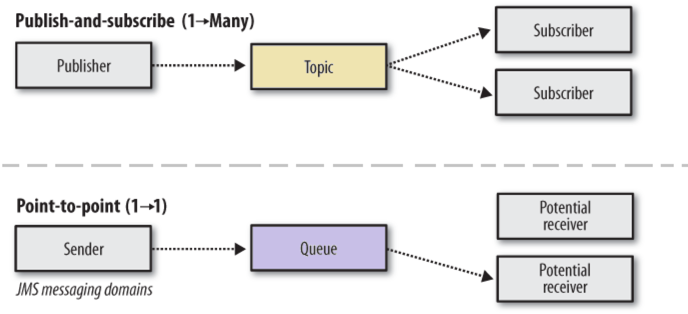

Т.к. асинхронная обработка снимает необходимость ответить клиенту сразу, мы получаем ряд важных свойств такой системы:
сервер может быть недоступен в момент запроса; система легко масштабируется, для увеличения пропускной способности
достаточно просто добавить новых обработчиков, брокер сам начнет присылать им задания; если возрастает нагрузка, то
система не захлебнется запросами, т.к. есть backpressure.

Несмотря на все плюсы асинхронной обработки, она очень сложна в реализации. Вот краткий список основных трудностей,
связанных с реализацией такого подхода:

* клиент и сервер должны гарантировать доставку и успешную обработку сообщений;
* каждый запрос становится заявкой и должен иметь персистентное состояние, чтобы гарантировать нахождение системы всегда
  в детерминированном положении. такую систему сложно мониторить, т.к. недоступность или ошибка в системе может
  выливаться лишь в увеличении очереди;
* система не прозрачна с точки зрения бизнес-процессов, т.к. синхронные процессы разрываются на асинхронные независимые
  этапы. Ее очень сложно проектировать и расширять.

#### Виды асинхронной обработки

Часто помимо обработки самого запроса требуется сделать много дополнительных вещей, связанных с самим запросом лишь
косвенно: запись статистики, инкременты счетчиков. Эти операции можно выполнить на этапе постобработки после того, как
ответ был отдан пользователю. Однако иногда описанного выше подхода с постобработкой данных недостаточно. Действия,
которые надо совершить с ними, могут занимать слишком много времени, а ресурсы веб-сервера не безграничные. В таком
случае помогает следующий архитектурный паттерн — сохраните данные в некое промежуточное хранилище, а затем обработайте
их с помощью отдельного асинхронного процесса. То есть данные собираются сейчас, а обрабатываются тогда, когда будет
удобно.

Примеры:

* Отложенная обработка: отправка письма о завершении регистрации в фоновом потоке.
* Фоновый процесс: отправка предагегированных данных в сервис статистики раз в час.

Важно понимать, что передавать большие сообщения по очереди не быстро, поэтому обычно данные сохраняются в персистентное
хранилище, а по очереди отправляется идентификатор записи в хранилище (обычно используется NoSQL). При этом, удалять
запись из хранилища нужно лишь после полного завершения обработки сообщения.

### Заявка, жизненный цикл заявки

Ввиду того, что в рамках распределенных систем мы взаимодействуем с другими системами, находящимися вне нашего контроля,
при проектировании следует предусматривать обработку отказов и некорректных состояний.

Введем понятие заявки как некоторой единицы работы, передаваемой для выполнения ко внешней системе. С каждой заявкой
обычно ассоциируется некоторый уникальный ID, служащий для ее идентификации как в системе-инициаторе, так и во внешней
системе. Это может быть либо один и тот же идентификатор, сообщаемый системе-инициатору заявки после принятия заявки на
обработку. Но это могут быть и два разных идентификатора: один создаётся в системе, обрабатывающей заявку, а другой
создается в системе обработчике. Наличие в пришедшем сообщении на создание заявки идентификатора заявки, назначенного
удалённой системой, крайне полезно, поскольку позволяет отбросить дубликаты таких сообщений.

Т.к. заявка является единицей работы, у нее должны быть начальное и конечные состояния. Под обработкой заявки
подразумеваем переход заявки из начального состояние в какое-то конечное (успешное/неуспешное). После попадания в
конечное состояние заявка уже не меняет свое состояние, а находится в некотором архиве завершенных заявок.

Кроме основного состояния, заявка обычно характеризуется множеством параметров, которые можно разбить на две группы.

* К первой относятся полученные извне параметры заявки, появляющимися в момент её создания из параметров сообщения, и,
  может быть, меняемые в дальнейшем. Эту группу мы будем (условно) называть параметрами запроса.
* Ко второй группе относятся добавленные в ходе выполнения заявки параметры, связанные с процессом обработки заявки. Это
  множество может меняться в процессе жизни заявки. Эту группу мы будем (условно) называть параметрами обработки заявки.

Очевидно, что создание протокола, допускающего произвольное изменение параметров запроса извне может быть довольно
сложным, особенно если речь идёт о запросе дополнительных ресурсов или частичном уменьшении требуемых ресурсов (
представим, что в ходе обработки заявки мы закупаем недостающий товар у третьего лица). Поэтому в реальных системах мы
часто видим ситуацию, когда единственным допустимым изменением со стороны является запрос на отмену заявки, а для
добавление ресурсов нужно послать запрос на создание новой заявки.

Естественным представлением жизненного цикла заявки является детерминированный конечный автомат с выходом. Формально
было бы верно считать множеством состояний этого автомата подмножество декартова произведения множества состояний заявки
и всех множеств значений параметров обработки заявки. Однако практическая полезность у такого автомата может быть только
при использовании формальных методов его исследования, для программиста же весьма сомнительна полезность автомата, где
каждая из N попыток повтора опроса M идентичных (с точки зрения уровня протокола) систем представлена отдельным
состоянием. В силу этого, при проектировании используется сокращённый вид автомата, где явно отображаются только
основные состояния заявки, в то время как состояние автомата определяется, формально, как подмножество декартово
произведения состояния и параметров. Функция перехода будет отображать состояние заявки, параметры заявки и сообщение (
со всеми его параметрами) в новое состояние заявки и в новые параметры заявки (например, число неудавшихся попыток
увеличилось на единицу). Состояния автомата соответствуют моментам времени, в котором он ожидает получения сообщений (от
внешних систем, подтверждения от человека и т.д.).

В соответствии с данным определением РС, автомат должен отвечать как минимум двум требованиям:

* при получении любого сообщения, на появление которого не удалось придумать сколь-нибудь разумную реакцию в данном
  состоянии, автомат либо остается в данном состоянии (и добавляет запись в журнал для дальнейшего разбора), либо
  переходит в конечное состояние;
* автомат должен попадать в одно из конечных состояний за конечный промежуток времени при любой входной цепочке внешних
  событий.

Таким образом, при каждой смене состояния должен запускаться (или продолжать работать) таймер, который пришлет сообщение
о таймауте, которое должно быть обработано автоматом.

Отметим, что успешная отправка сообщения в РС не означает, что сообщение принято к исполнению, поэтому нет оснований
утверждать, что мы когда-нибудь получим ответ. Поэтому, в силу требования надежности, использование таймеров необходимо
всегда.

## Отказоустойчивость


Самые сложные ошибки в распредленных системах связаны с рассинхронизацией данных. Приложение должно быть написано таким
образом, чтобы при некорректной обработке сообщения, система оставалсь в детерминированном состоянии. Для этого нужно _
всегда_ предусматривать обработку некорректных ситуаций.

### Потеря сообщений

Часто при разговоре про взаимодействие через очереди говорят что "очередь дает гарантию доставки сообщений". Рассмотрим
этот вопрос подробнее.

Сообщения могут теряться потому что:

* не включен persistence на брокере;
* нет транзакционности на стороне отправителя и получателя;
* нет ожидания ACK на стороне отправителя;
* AUTO ACK на стороне получателя;
* запись на диск на брокере буферизуются, т.е. при отключении питания на брокере сообщения, хранящиеся в буфере,
  потеряются.

##### Потеря сообщений на Producer

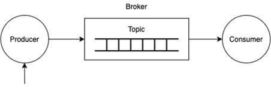

Если данные передаются по UDP или обрывается TCP соединение, то клиент должен ожидать подтверждение получения от брокера
и переотправлять сообщения, если это подтверждение не пришло.

##### Потеря сообщений на Broker

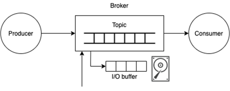

* Если на брокере не включена persistence, то при падении ноды данные теряются.
* Если persistence включена, то писать каждое сообщение на диск очень затратно, поэтому используется буферизованная
  запись на диск, а значит при падении, эти данные из буфера потеряются.
* Обычно на боевых серверах разворачивается кластер в несколько нод и используется репликация. Здесь можно выбрать три
  политики согласования:
    * At Least One – хотя бы одна из реплик подтвердила запись;
    * Quorum – большинство реплик записало данные;
    * All – все реплики записали данные.
* В случае с брокером, развернутом на несколько нод, если отдавать подтверждение когда все сервера в реплике получили
  свои данные, то это очень затратно по времени, если это делать в фоне, то данные, которые не успели реплицироваться,
  теряются.

##### Потеря сообщений на Consumer


* Если данные передаются по UDP или обрывается TCP соединение, то на брокере должен ожидать подтверждение доставки и
  переотправлять сообщения, если это подтверждение не пришло.
* Если потеряется подтверждление, то броке через какое-то время перенаправит это сообщение другому Consumer'у, а значит
  Consumer должна быть реализован так, чтобы не обрабатывать дубли, или обрабатывать их идемпотентно.
* Consumer сразу отдает ACK, то при ошибке обработки или падении сервера, данные потеряются. Но если Consumer ждет
  окончания обработки, то это сильно тормозит брокера.

### Дубликаты сообщений

Для предотвращения дважды отправленных сообщений на producer'е добавляется уникальный ID в Message Header. Этот
заголовок читается на брокере, и он отфильтровывает дубликаты (если включена политика поиска дубликатов). Consumer
должен отправить ACK на провайдер когда получил сообщение (сообщение может оказаться битым, т.к. мы уже ответили брокеру
что все ОК, мы его не получим), либо отвечать ACK только когда сообщение обработалось. Это очень сильно снижает
производительность. Так же в момент отправки ACK сеть может упасть и брокер не получив информацию отправит сообщение еще
раз, и если сообщение не содержит никакого уникального идентификатора, то мы не сможем с уверенностью сказать что именно
это сообщение было уже обработано.

### Деградация функциональности

Если у нас есть запрос на чтение, то в случае недоступности некритичной части системы, мы можем отдавать пользователю
ответ не со всем набором данных.

Например, если мы открываем главную страницу `mail.ru` для проверки почты, то нам важно, чтобы виджет почты показал нам
количество новых сообщений. При этом на самой странице есть еще много дополнительной информации, например виджет погоды,
и если сервис, который отдает данные для этого виджета недоступен в данный момент времени, то мы просто не будем
выводить его или отдадим устаревшие закешированные данные. Для большинства пользователей это будет незаметно.

Если же мы из-за недоступности отдадим страницу с 500 ошибкой, то это заметят все пользователи и посещаемость нашей
страницы упадет.

Деградацию функциональности можно реализовать тремя разными путями:

* отдаем просто пустой ответ и ничего не выводим;
* отдаем какой-то fallback ответ или просто выводим ID по которому нужно было получить информацию (например, если нам
  надо получить ФИО пользователя по его login);
* отдаем закешированные устаревшие данные (как с виджетом погоды).

### Некорректное выполнение операций

Если мы рассматриваем микросервисную архитектуру, то система разбита на независимые сервисы, а каждый сервис имеет свое
независимое хранилище данных, то нам надо гарантировать консистентность данных в случае, если какая часть операций
завершилась неудачно.

Предположим, у нас есть система, позволяющая продавать какие-то позиции (биллнг) и в автоматическом режиме передающая
данные в складскую систему, для начала немедленной отгрузки товара. Понятно, что выполнять отгрузку товара можно
начинать только после успешной оплаты. И этот вариант мы можем легко предусмотреть, дожидаясь успешного завершения
обработки от билингвой системы.

Но что делать, если оплата прошла успешно, а обработка в складской системе завершилась неудачей?

#### Повторная попытка

Самый просто способ в этой ситуации – перенести заявку в очередь и выполнить операцию еще раз через какое-то время, а
сервису, инициировавшему запрос вернуть ответ, что все хорошо. Для некоторых видов операций в этом есть определенный
смысл, но мы должны гарантировать, что повторная попытка исправит ситуацию. Вместо использования транзакционной границы
как гарантии согласованного состояния по окончании транзакции мы допускаем, что система сама приведет себя в
согласованное состояние в какой-то будущий момент времени.

#### Отмена всей операции

Еще один вариант заключается в отмене всей операции. В этом случае систему нужно вернуть в прежнее согласованное
состояние. Необходимое действие выполняется в рамках компенсационной транзакции, то есть запуска новой транзакции для
отката всего, что только что случилось. В нашем случае все может свестись к простой выдаче инструкции удаления DELETE,
предназначенной для удаления заказа из базы данных. Затем нужно будет отчитаться в пользовательском интерфейсе о сбое
операции. В монолитной системе наше приложение может справиться с обоими аспектами, а вот когда код приложения уже
разбит на части, нужно призадуматься о том, что делать. Где именно должна находиться логика управления компенсационной
транзакцией, в клиентском сервисе или где-то еще? А как быть, если произойдет сбой компенсационной транзакции?
Вероятность этого не исключена. Тогда у нас будет оплаченный заказ, не имеющий соответствующей ему инструкции по
сборке. В такой ситуации нужно либо провести компенсационную транзакцию повторно, либо позволить какому-нибудь
внутреннему процессу убрать несогласованность чуть позже. Можно было бы просто воспользоваться экраном обслуживания с
доступом только со стороны административного персонала или же использовать автоматизированный процесс. Все становится
намного запутаннее, когда требуется выполнить согласованность более двух операций. Проведение компенсационных
транзакций для каждого сбойного режима очень трудно не то что реализовать, но даже осмыслить.

#### Распределенные транзакции

Альтернативой ручной организации компенсационных транзакций является использование распределенной транзакции.
Распределенные транзакции пытаются объединить в себе сразу несколько транзакций, используя для управления различными
транзакциями, проводимыми в базовых системах, общий управляющий процесс, называемый диспетчером транзакций. Точно
так же, как и обычная транзакция, распределенная транзакция старается гарантировать пребывание всего в согласованном
состоянии, только она пытается сделать это в рамках нескольких систем, запущенных в различных процессах, связь между
которыми зачастую осуществляется через сетевые границы. Наиболее распространенный алгоритм управления распределенными
транзакциями заключается в использовании двухфазной фиксации.

Двухфазный commit имеет два четко разделенных этапа:

* **Commit Request** – координатор посылает сообщение участникам распределенной транзакции о подготовке к транзакции (
  prepare message). Это сообщение также содержит уникальный номер транзакции TID. Когда участники получают это
  сообщение, они проверяют смогут ли зафиксировать транзакцию и отвечают координатору. При этом транзакция исполняется,
  но не фиксируется и её состояние сохраняется на диске;
* **Commit Completion** - после того, как координатор получил все ответы, он решает зафиксировать или прервать начатую
  транзакцию в соответствии с правилом глобальной фиксации. Если все участники глобальной транзакции ответили, что могут
  ее зафиксировать, то он посылает участникам сообщение о фиксации транзакции, в противном случае все участники получают
  сообщение об откате транзакции.

Такой подход предполагает, что все участники останавливаются, пока центральный координационный процесс не даст
команду на продолжение работы. Если диспетчер транзакций зависнет, отложенные транзакции никогда не завершатся. Если
сервис не ответит в процессе голосования, все будет заблокировано. И неизвестно, что произойдет, если фиксация даст
сбой после голосования. В этом алгоритме есть безусловное предположение о том, что такого никогда не случится: если
партнер сказал "да" при голосовании, значит, мы должны предполагать, что его транзакция будет зафиксирована. Партнерам
нужен способ, позволяющий заставить фиксацию происходить в нужный момент. Это означает, что данный алгоритм не
защищен от сторонних сбоев, вернее, он предусматривает попытку обнаружения большинства случаев сбоев. Этот
координационный процесс предусматривает также установку блокировок, то есть отложенная транзакция должна удерживать
блокировку ресурсов.

Блокировка ресурсов может привести к конкуренции, существенно усложняя масштабируемые системы, особенно в контексте
распределенных систем. Все эти решения усложняют систему. Разобраться в распределенных транзакциях довольно трудно и
фактически они могут воспрепятствовать масштабированию. О системах, которые в конечном итоге сводятся к компенсационной
логике повторов, труднее рассуждать, и для устранения несогласованности данных они могут нуждаться в ином
компенсационном поведении. Когда вам встречаются бизнес-операции, проводимые в данный момент в рамках единой
транзакции, задайте себе вопрос, действительно ли они должны это делать. Не могут ли они проводиться в различных
локальных транзакциях и полагаться на концепцию возможной согласованности? Создавать такие системы и заниматься их
масштабированием намного проще. Если попадется такое состояние, необходимость в согласованности которого не вызывает
никаких сомнений, то в первую очередь сделайте все возможное, чтобы избежать разбиения. Приложите для этого все
усилия. Если же разбиения будет не избежать, подумайте об изменении чисто технического взгляда на процесс и создайте
конкретные понятия, представляющие саму транзакцию. Это даст вам возможность зацепиться за запуск других операций,
подобных компенсационным. транзакциям, а также за способ отслеживания этих более сложных понятий в вашей системе и
управления ими.

## Event-Driven Architecture

В очередь публикуется событие об изменении состояния какого-либо сервиса, все заинтересованные сервисы слушают это
событие и выполняют внутренние действия, связанные с этим событием. Возможно, они могут порождать новые события,
переводящие всю систему в следующее состояние. Это очень гибкий архитектурный паттерн, но т.к. события не всегда 1:1
ложатся на бизнес процесс, этот бизнес-процесс становится неявно размазанным по нескольким сервисам. Плюс к этому,
компенсационные операции становится проводить еще сложнее, т.к. системы настолько изолированы друг от друга, что откат
некорректной операции можно проводить только с помощью создания отдельных событий.

#### Когда следует использовать этот подход

* для обработки одних и тех же событий несколькими подсистемами;
* для обработки в режиме реального времени с минимальными задержками;
* для обработки сложных событий, например сопоставления шаблонов или статистической обработки за некоторый период;
* при больших объемах и скоростях поступления данных.

#### Преимущества

* отправители и получатели независимы друг от друга;
* нет интеграции "point - point", легко добавлять в систему новые объекты-получатели;
* получатели могут реагировать на события сразу при их поступлении;
* высокая масштабируемость и распределение;
* подсистемы получают независимые представления потока событий.

#### Проблемы

* гарантированная доставка: в некоторых системах важно гарантировать доставку событий;
* обработка событий в строгом порядке и (или) строго один раз: каждый тип потребителя обычно выполняется на нескольких
  экземплярах, чтобы обеспечить надежность и масштабируемость. Это создает некоторые трудности, если события должны
  обрабатываться в строгом порядке (для каждого типа потребителя) или логика их обработки не является идемпотентной.
* Очень сильно усложняется откат операций, т.к. нотификация об неуспешном завершении операции должна производится так же
  через события.
* Непрозрачность бизнес-операций, т.к. события не всегда прозрачно ложатся на выполняемые операции.

## Очереди

### Локальная очередь

Если требуется реализовать взаимодействие между потоками, то стоит обратить внимание на реализации очередей в самом
языке. Для Java, например, можно использовать `BlockingQueue`. При этом все взаимодействие происходит внутри программы и
нет затрат времени на общение с брокером по сети.

Но для очереди очень полезно иметь мониторинг ее состояния (доступность, размер и т.д.), а для встроенных в язык
очередей это придется делать руками, что не всегда является удобно.

### RabbitMQ

RabbitMQ – распределенная очередь, реализованная на Erlang'е, реализующая протокол `AMPQ`. `AMQP` – протокол
предназначенный для систем обмена сообщениями и описывающий характеристики и функции сообщений, очередей, роутинга,
доступности и безопастности, а также схемы поведения сервера сообщений (брокера) и клиента. Таким образом это некая
спецификация того как должны общаться между собой брокер и клиент - формат и тип сообщений, метод передачи данных и т.д.
`AMQP` совместимость избавляет от привязки клиента к конкретному брокеру, так как клиент поддерживающий `AMQP` может
общаться c любым совместимым брокером.

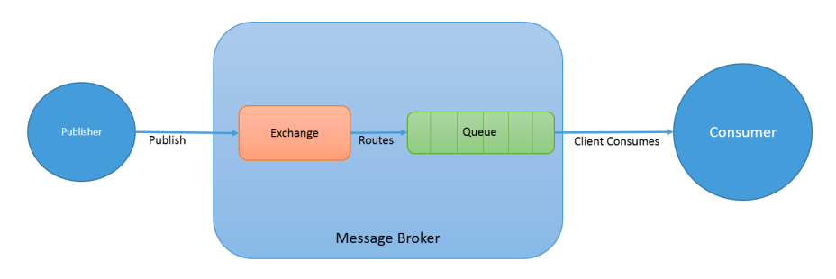

Основная идея модели отправки сообщений Rabbit – producer отправляет сообщение в точку доступа (Exchange), а не напрямую
в очередь. Точка доступа выполняет две функции:

* получает сообщения от producer;
* отправляет эти сообщения в очередь.

Точка доступа точно знает, что делать с поступившими сообщениями. Отправить сообщение в конкретную очередь, либо в
несколько очередей, либо не отправлять никому и удалить его. Эти правила описываются в типе точки доступа (Exchange
Type).

Существует несколько режимов работы очереди:

* `direct` – сообщения направляются подписчикам по принципу round-robin;
* `fanout` – сообщение рассылается всем подписчикам (широковещательная рассылка);
* `topic` – роутинг выполняется на основе шаблона.

Объявлять очередь и связывать её с обменником можно как на Producer'е, так и на Consumer'е, все зависит от того, что
первым будет запускаться. Если неизвестно, то, возможно следует объявить и там и там. При этом имена очередей должны
совпадать. Если имена очередей совпадают, то количество объявлений не имеет значения. Очередь с определенным именем
может быть только одна. Сообщение не может быть опубликовано напрямую в очередь, оно должно проходить через Exchange.

Для реализации распределенной очереди в RabbitMQ тип обменника устанавливается в `fanout`. Тогда все сообщения,
посылаемые в указанный обменник, независимо от имени очереди и ключа роутера, будут прослушиваться всеми запущенными
копиями Consumer, т.е. каждое следующее сообщение будет отсылаться на следующий свободный consumer. Такой способ
обработки получил название Round-Robin Dispatching.

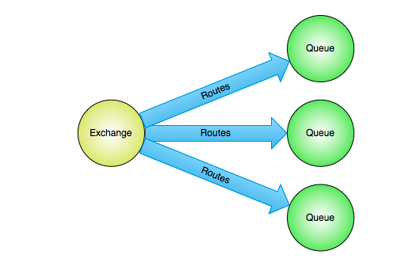

Некоторые задачи могут выполняться довольно долго и неизвестно, что может произойти с сервером в этот момент: сервер
может перезагрузиться, либо задача может зависнуть или завершится фатальной ошибкой. Для предотвращения этого нужно
возвращать брокеру информацию об удачном завершении только после завершения самой обработки, чтобы последний мог удалить
это сообщение. В противном случае RabbitMQ понимает, что сообщение не обработано и перенаправляет его другому свободному
Consumer. Однако здесь стоит отметить один важный момент. Перенаправленные сообщения не будут обрабатываться до того
пока Consumer не отконнектится и приконнектится заново к брокеру. Если необходимо заново обработать сообщение в рамках
того же коннекта к серверу сообщений, то необходимо вызвать метод `nack()` с флагом `require`, который поставит неудачно
обработанную задачу обратно в очередь и уведомит брокер о том, что эта задача должна быть вновь обработана.
Распространенная ошибка – при включенном оповещении не подтверждать корректно обработанные сообщения, в этом случае при
каждом новом коннекте, все уже обработанные задачи будут поступать заново на обработку. Процесс будет выглядеть как
беспорядочная повторная отправка сообщений, что в конечном итоге приведет к переполнению памяти.

Для предотвращения потери сообщений на брокере в случае его внезапной остановки используется флаг `durable`. Этот флаг
включает персистентность очереди. Установка этого флага не гарантирует стопроцентную сохранность сообщений в очереди.
Несмотря на то, что таким способом мы указываем RabbitMQ сохранять сообщения на диске, существует мертвая зона после
получения сообщения, когда оно уже в памяти, но еще не сохранено на диске. В этот момент, в случае не предвиденной
ситуации, оно может быть утеряно из памяти. Для простых случаев гарантий достаточно, но если сообщения обладают высокой
критичностью, то следует использовать транзакции.

Для управления адресатами сообщений используется ключ `routing_key`, который диспечеризует сообщения на потребителей,
чей
`routing_key` совпадает с `routing_key` сообщения, причем таких может быть несколько. Важно заметить, что для обменника
с типом `fanout`, он просто игнорируется.

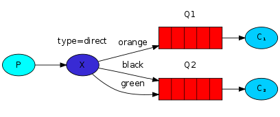

Для выполнения связи по шалбону обменник должен иметь тип `topic`. Ключи `routing_key` составляются из слова, следующих
через точку, например, `logs.devices.kernel.notice`, `logs.devices.cron`. Максимальная длина такого ключа может
составлять 255 символов. Логика доставки сообщений по ключу схожа с логикой для обменников с типом `direct` – сообщения
с определенным ключем будут доставлены в очереди с соответствующим ключем. Но есть одна большая разница. Ключи,
используемые для связи по шаблону, могут содержать два специальных символа: `*` – соответствует строго одному слову, `#`
– соответствует любому количеству слов, в том числе и отсутствию слов.

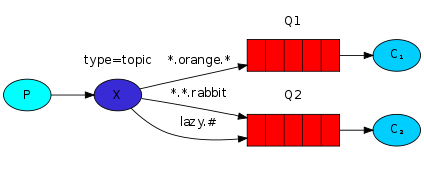

Обменник с типом `topic` может повторять поведение обменника с типом fanout, если с ним связать очередь по ключу `#`.
Если в ключе не использовать специальных символов, то такой обменник будет соответствовать обменнику с типом `direct`.

```shell
# скрипт выводит и обновляет каждые 2 секунды таблицу со списком очередей:
# имя очереди | количество сообщений в обработке | количество сообщений готовых к обработке | общее количество сообщений | устойчивость очереди к перезагрузке сервиса | является ли временной очередью | количество подписчиков
watch 'sudo /usr/sbin/rabbitmqctl list_queues name messages_unacknowledged messages_ready messages durable auto_delete consumers | grep -v "\.\.\." | sort | column -t;'```
```

Подтверждения:

* _basic.ack_ – сообщение доставлено и обработано, можно удалять;
* _basic.nack_ – сообщение не обработано, положить его обратно в очередь;
* _basic.reject_ – сообщение не обработано, но его можно удалять.

Несмотря на то, что брокер ожидает подтверждение, потребитель не блокируется. Другие сообщения будут доставляться другим
потребителям, если предыдущее сообщение доставлено по получателя (но еще не пришел ack), либо переотправлено в очередь,
если связь оборвалась. С учетом сказанного, единственный способ гарантировать FIFO – это иметь только одного потребителя
на очередь. Ack является формальным сигналом, что сообщение обработано (а не досталавено).

Существует автоматическое подтверждение сообщений (fire-and-forget), оно увеличивает пропускную способность сервера, но
значительно сокращает надежность обработки. Если в процессе отпарвки было закрыто TCP-соединение, то сообщение теряется.
Во-вторых, с использованием автоматического подтверждения, можно получить ситуацию, когда получатель "захлебнется"
сообщениями, т.к. manual-ack служил индикатором готовности обработки (некоторые клиенты реализуют TCP backpressure –
остановка чтения их сокета пока количество сообщений не достигнет определнного уровня).

Если сообщение отправлено обратно в очередь, то оно вставляется на свое место (если возможно) или как можно ближе к
голове очереди.

Т.к. сообщения и подтверждения являются асинхронными, существует понятие "плавающего окна" (prefetch count). Окно задает
максимальное количество неподтвержденных сообщений в очереди. Как только этот порог достигнут, RabbitMQ останавливает
передачу сообщений и ждет подтвреждения.

### Redis

Redis (Remote Dictionary Server) — это нереляционная высокопроизводительная СУБД. Redis хранит все данные в памяти,
доступ к данным осуществляется по ключу. Этот подход обеспечивает производительность, в десятки раз превосходящую
производительность реляционных СУБД, а также упрощает шардинг данных.

При этом Redis умеет сохранять данные на диск. Можно настроить Redis так, чтобы данные вообще не сохранялись,
сохранялись периодически по принципу Copy-On-Write, или сохранялись периодически и писались в журнал (используется
Append-only Log). Таким образом, всегда можно добиться требуемого баланса между производительностью и надежностью.

Очень большим преимуществом Redis является возможность хранить не только строки, но и списки (`Lists` - на их основе
строится очереди), множества (`Sets`), hash-таблицы (`Hashes`) и упорядоченные множества (`Sorted Sets`).

* **Строки** - любой объект, сериализованный в строковое представление. Максимальный размер 2Гб.
* **Списки** имеют время доступа к произвольному элементу O(N), но при этом время доступа к голове и ховсту списка
  выполняется за O(1). Хорошим использованием списков будут простые очереди и стеки, или циклическая обработка элементов
  командой
  `RPOPLPUSH`, параметрами которой будет один и тот же список.
* **Множество** — это не упорядоченный набор данных, оно эффективно для быстрой проверки присутствие элемента в
  коллекции.
* **Hash-таблицы** используются для представления объектов, составленных из полей и значений. Поля хэшей могут быть
  атомарно инкрементированы командой `HINCRBY`.
* **Упорядоченное Множество** — структура данных, поддерживающая работу с упорядоченными элементами. Обычно используются
  для очередй с приоритетами. Упорядоченные множества — это что-то вроде более мощных списков, в которых вставка,
  удаление или получение элементов из середины списка так же быстро. Но они используют больше памяти, и
  являются `O(log(N))` структурами.

На любой ключ можно установить его время жизни через `expires`. Если время жизни истекло, то значение будет удалено при
следующем обращении по ключу.

В redis существует понятие транзакции – все команды записи будут стерилизованы и выполнены в рамках одной изолированной
операции (в очередь выполнения не влезет команда от другого клиента). До вызова `MULTI` операции лишь ставятся в очередь
выполнения, а применяются после вызова `EXEC`. При этом, если одна из операций падает, остальные операции продолжают
выполняться и изменения применяются. Вручную транзакцию можно откатить командой `DISCARD`.

Так же в Redis есть команда `WATCH`, она реализует поведение Check-And-Set, т.е.:

```shell
WATCH mykey
val = GET mykey
val = val + 1
MULTI
SET mykey $val
EXEC
```

Если в процессе выполнения будет выполнения значение `mykey` будет изменено, то транзакция завершится с ошибкой.

### Kafka

Apache Kafka – это распределенная система передачи сообщений, которая позволяет разрабатывать приложения, использующие
потоковые данные в режиме реального времени. Kafka обеспечивает бесшовную интеграцию между поставщиками информации и
потребителями, не блокируя поставщиков информации. Для персистентности сообщений используется Append-only Log, т.е.
записи сначала добавляются в специальный лог, работающий только на append, а уже после выполняется сама операция.

Каждый topic делится на один или более патриции (Partitions), сообщения внутри патриции упорядочены по времени
добавления и имеют уникальный идентификатор (уникальный внутри партиции), называющийся смещением (Offset).


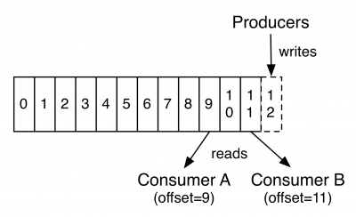

Сообщения в разных патрициях не упорядочены друг с другом! Если требуется упорядоченность сообщений в рамках топика, то
нужно использовать лишь одну партицию. Партии используются для обеспечения параллельной обработки сообщений.

Consumer Groups – объединение нескольких потребителей в группу таким образом, чтобы каждое сообщение приходило одному
потребителю. Другими словами, это масштабирование на чтение. Участники группы читают из разных партиций. Отсюда следует,
что количество партиций должно быть не меньше, чем средний размер группы.

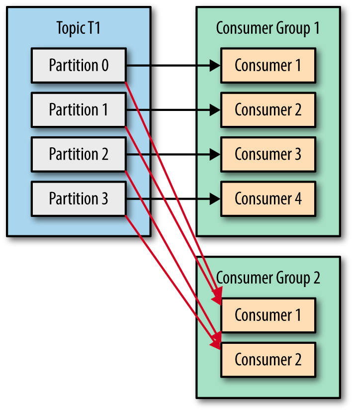

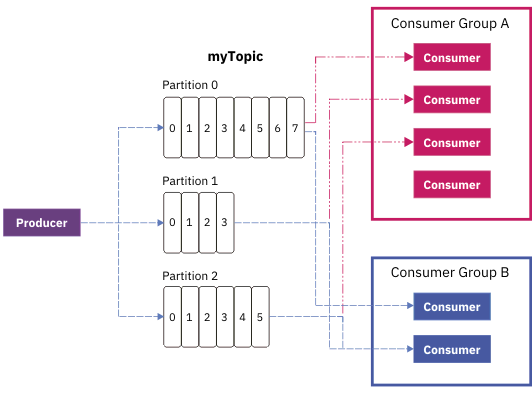

Поскольку Kafka по своей природе является распределенной системой, кластер состоит из нескольких брокеров. Topic
разбивается на партиции, и каждый брокер отвечает за хранение одной или нескольких партиций. Это дает возможность
множеству производителей и потребителей публиковать и использовать сообщения для своих целей одновременно.

Внутри каждой патриции есть Replication Factor – количество реплик (байт-в-байт), на которые пришедшее сообщение
дублируется. Для каждой патриции выбирается лидер (нода), на который происходит запись, а c лидера в свое очередь
происходит репликация данных на N других серверов для обеспечения отказоустойчивости.

#### Контроль размера топика

Данные удаляются по прошествию какого-то времени, а не в момент прочтения сообщения. В случае падения потребителя, после
перезапуска потребитель просто продолжает читать с определенного места.

Для передачи сообщения полезно задавать `key:payload`, по этому ключу Kafka вычисляет в какую реплику передавать
сообщение. Т.е. если требуется упорядоченность сообщений, то для одинаковых сообщений нужно задавать `key`. Например,
если пользователь изменяет email, то сообщение должно передаваться в виде:`key: <user_id>, payload: <email>`, таким
образом они попадут в одну и ту же партицию и будут обработаны в нужном порядке.

Для контроля объема топика используется несколько подходов:

#### Remove old items

Данные будут удалены по прошествию времени (3 days, 1 week, etc) или при достижении определенного размера (10Gb).

#### Log compaction

Хранится только срез последних данных по ключу, все остальные данные удаляются, т.е. на каком-то расстоянии от головы
очереди из старых записей по каждому ключу выбирается последняя запись, а все старые удаляются, при этом порядок
следования не меняется.

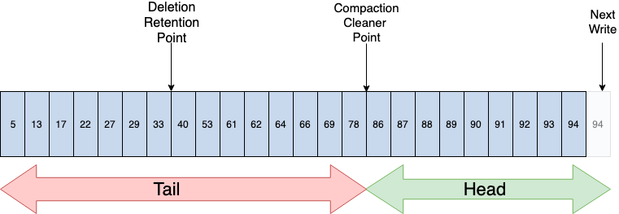

Лог разбивается на две части: Head и Tail. Kafka гарантирует, что в Tail все ключи уникальны, потому что Tail обновлялся
при предыдущем проходе процесса упаковщика. Вес новые записи добавляются в в конец Head. При этом в Compacted Topic
будут храниться все старые записи по уникальному ключу. Если нужно эти записи удалить, то нужно отправить в очередь
сообщение с `key:null`, `null` будет рассматриваться как tombstone и запись будет удалена.

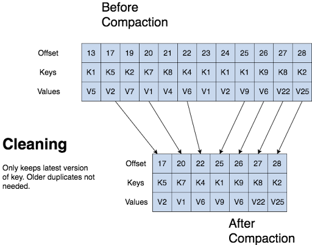

## Теорема CAP

Суть теоремы CAP заключается в том, что в распределенных системах есть три компромиссных по отношению друг к другу
свойства: согласованность, доступность и терпимость к разделению и при отказе удается сохранить только два из них.

* **Согласованность (Consistency)** является характеристикой системы, означающей, что при обращении к нескольким узлам
  будет получен один и тот же ответ.
* **Доступность (Availability)** означает, что на каждый запрос будет получен ответ не содержащий ошибок.
* **Терпимость к разделению (Partition tolerance)** является способностью системы справляться с тем фактом, что
  установить связь между её частями порой становится невозможно. Тут важно заметить, что под терпимостью к разделению
  имеется ввиду именно умение переживать сетевую недоступность.

Теорема имеет строгое математическое доказательство, но для лучшего понимая рассмотрим её суть на примере.

Представим, что сервис развернут на базе двух отдельных дата-центров. В каждом дата-центре экземпляры сервиса
поддерживает база данных, и эти две базы данных обмениваются данными, стараясь синхронизировать их между собой.
Операции чтения и записи осуществляются через локальный узел базы данных, а для синхронизации данных между узлами
применяется репликация.

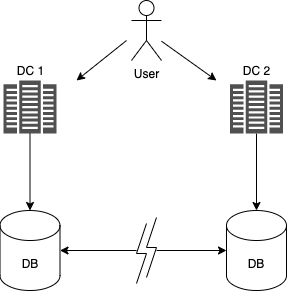

Теперь подумаем о том, что случится, когда что-нибудь откажет. Представим, что между дата-центрами пропала сетевая
связь. С этого момента синхронизация даст сбой. Записи, осуществляемые в основную базу данных в дата-центре DC1, не
будут дублироваться на дата-центр DC2, и наоборот. Большинство баз данных, поддерживающих такие настройки, поддерживают
также какую-либо разновидность технологии выстраивания очередей, чтобы впоследствии обеспечить возможность
восстановления из этой ситуации. Но что произойдет до такого восстановления?

#### Принесение в жертву согласованности

Предположим, что сервис нами полностью не отключен. Теперь при внесении изменений в данные в DC1 база данных в DC2 их
не видит. Это означает, что любой запрос, обращенный к узлу в DC2, увидит потенциально устаревшие данные. Иными
словами, система все еще доступна на обоих узлах, способных обслуживать запросы, и мы сохранили работоспособность
системы, несмотря на разделение, но утратили согласованность. Зачастую это называется AP-системой.

Мы не можем сохранить все три свойства. Если в период данного разделения будет продолжено получение записей, значит,
мы смирились с тем фактом, что через некоторое время записи будут рассинхронизированы. Чем дольше продлится разделение,
тем труднее будет восстанавливать синхронизацию. Реальность такова, что даже при отсутствии сетевого сбоя между узлами
баз данных репликация данных не проводится мгновенно. Как уже говорилось, системы, которые готовы поступиться
согласованностью для сохранения терпимости к разделению и доступности, называются согласованными по прошествии
некоторого времени (Eventual Consistency). Иначе говоря, ожидается, что в некоторый момент в будущем обновленные данные
станут видны всем узлам, но это не произойдет немедленно, поэтому придется смириться с вероятностью того, что
пользователи увидят устаревшие данные.

#### Принесение в жертву доступности

А что, если потребуется сохранить согласованность и отказаться вместо нее от чего-то другого? Итак, для сохранения
согласованности каждый узел базы данных должен знать, что у него имеется такая же копия данных, как и у других узлов
баз данных. Теперь при разделении, если узлы баз данных не могут связываться друг с другом, они не могут выполнять
координацию для обеспечения согласованности. Мы не в состоянии гарантировать согласованность, поэтому единственным
вариантом остается отказ от ответа на запрос. Иными словами, мы приносим в жертву доступность. Система согласована и
терпима к разделению, или же можно сказать, что она приняла форму CP. В этом режиме сервису придется выработать меры
снижения уровня функциональности до тех пор, пока не будет преодолено разделение и узлы баз данных не восстановят
синхронизированность.

#### Принесение в жертву мастабирования

Обеспечить согласованность нескольких узлов довольно трудно. Представим, что нужно прочитать запись из локального узла
базы данных. Как узнать, что эта запись не устарела? Нужно обратиться с вопросом к другому узлу. Но так же требуется
заблокировать эти данные на запись до тех пор, пока чтение не будет завершено, иными словами, для обеспечения
согласованности нужно инициировать транзакционное чтение между несколькими узлами баз данных. Транзакционное чтение
очень медленное и может заблокировать всю систему целиком. Для выполнения этой задачи всем согласованным системам
требуется определенный уровень блокировки.

Если система рассчитывает на то, что сеть абсолютно надёжна, и благодаря этому она может обеспечить консистентность
данных на всех узлах, то значит система принимает форму CA. Фактически это условие выполняется только в вырожденном
случае, когда система состоит из одного узла, где неконсистентности быть не может, и которая доступна всегда, когда
доступен её узел. Но в таком случае нельзя рассматривать эту систему как распределённую.

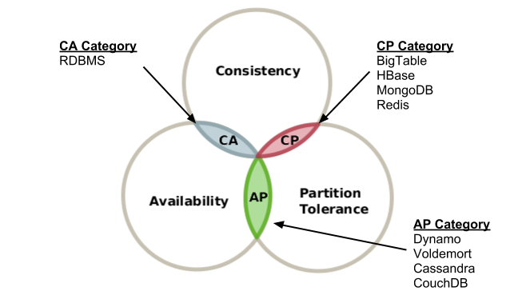

## Протоколы распределенных систем

### Протокол RAFT

Raft является алгоритмом распределённого консенсуса, который нужен, чтобы несколько участников могли совместно решить,
произошло ли событие или нет, и что за чем следовало. Данные, обслуживаемые кластером Raft, представляют собой лог,
состоящий из записей.

Для обеспечения консенсуса в Raft сначала выбирается лидер, на котором будет лежать ответственность за управление
распределённым логом. Лидер принимает запросы от клиентов и реплицирует их на остальные сервера в кластере. В случае
выхода лидера из строя, в кластере будет выбран новый лидер.

Когда пользователь хочет изменить данные, он отпарвляет данные на мастер, а мастер реплицирует эти данные по всем нодам.

Каждая нода может быть в одном из трех состояний:

* Leader – обрабатывает клиентские запросы на запись;
* Follower – пассивный сервер, который перенаправляет все входящие запросы от клиентов на Leader и обновляет свои данные
  при получении новой версии данных. По сути, является Hot-Standby репликой Leader.
* Candidate – состояние ноды, возможное только при выборе нового Leader.

##### Выбор лидера

Leader с интервалом HeartBit Timeout рассылает всем участникам кластера AppendEntries запросы (включают HeartBit),
которыми он извещает участников что он жив и передает новые обновления.

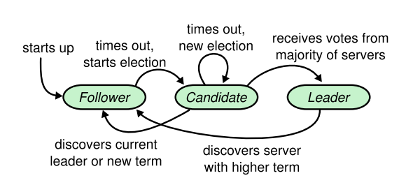

Если Follower нода не получает данные от Leader в течении Election Timeout, то она считает что Leader больше нет и
запускает новые выборы (переходит в статус Candidate).

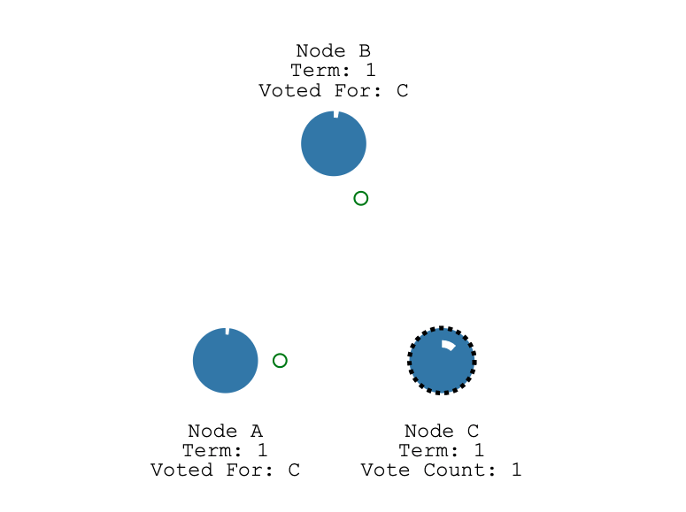

После этого нода голосует за себя и отправляет Request Vote остальным участникам кластера. Если эти участники не отдали
свой голос за другого Leader, то они отдают свой голос за этого кандидата. Нода становится Leader если получит
большинство голосов. Размер кластера обычно делают нечетным, чтобы выборы закончились в первом туре (3 ноды в статусе
Candidate случаются редко). После того, как нода отдала свой голос, она сбрасывает Election Timeout. Если случилось
ситуация, что два Candidate получили одинаковове количество голосов, они переходят в состояние Follower и сбрасывают
свой Election Timeout. Т.к. Election Timeout разные для каждой ноды, ноды инициируют голосование в разное время.

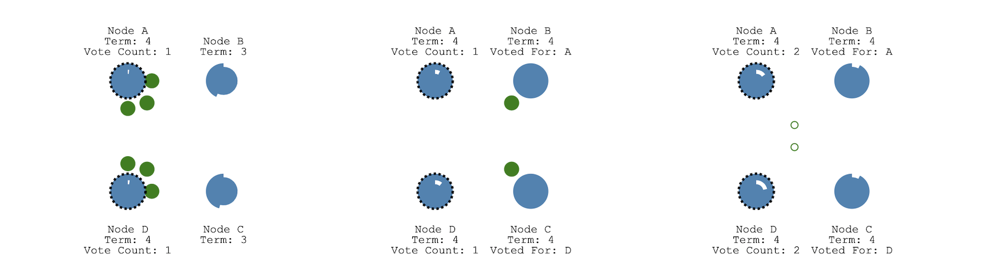

##### Message Replication

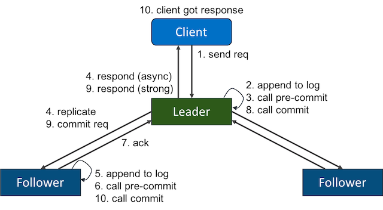

1. Клиент отправляет новые данные на Leader, он кладет в свой log новую запись, содержащую команду на изменение, но не
   применяет ее, и рассылает всем Followers AppendEntries сообщение, чтобы они могли тоже добавили эту запись себе.
1. Когда запись будет успешно разреплицирована на большинстве серверов, Leader начинает считать запись закоммиченой и
   отвечает клиенту.
1. Leader следит за тем, какая запись является последней: он отправляет номер этой записи в AppendEntries, чтобы
   Followers могли закоммитить запись у себя.

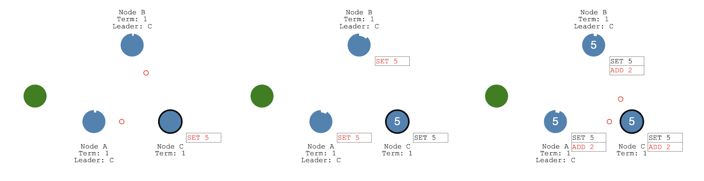

Предположим, что размер кластера нечетный. Если в таком случается сетевая недоступность, то кластер разделяется на
неравные части. В меньшей части происходит выбор нового Leader, но он не сможет закоммитить сообщение, т.к. не получит
подтвреждения большиснства. После восстановления сети Leader получит AppendEntries от Leader с большим количеством
голосов и откатит свои изенения.

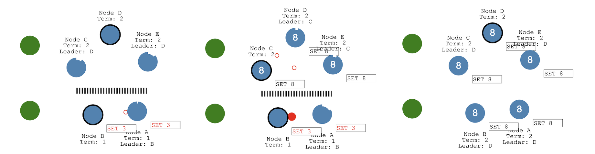

### Протокол Paxos

В алгоритме Paxos есть понятие ролей, рассмотрим основные:

* Proposers (Leader) – узлы, которые отправляют остальным предложения о новом значении в распределенной системе. Их
  задача запустить раунд предложения нового значения и координировать дальнейшие действия узлов. Причем Paxos допускает
  наличие нескольких лидеров в определённых ситуациях.
* Acceptors (Voters) — узлы, которые голосуют за принятие или непринятие того или иного значени и запоминают принятое (
  номер и значение). Acceptor примет первое поступившие предложение и будет принимать последующие даже если выбор уже
  сделан.
* Learners — узлы, которые просто принимают и записывают новое принятое значение, когда состояние системы изменилось.
  Они не принимают решения, а просто получают данные и могут отдать их конечному пользователю.

Алгоритм Paxos состоит из двух больших этапов:

##### Phase 1a: Prepare

На этапе подготовки Proposer рассылает анонс, что планируется новый раунт N. Пока он просто сообщает о начале нового
цикла, но не сообщает новое значение. Задача этого этапа инициировать новый раунд и сообщить всем его уникальный номер.
Номер раунда важен, это должно быть значение большее, чем все предыдущие номера голосований от всех предыдущих лидеров.
Так как именно благодаря номеру раунда другие узлы в системе будут понимать, насколько свежие данные у лидера. Вероятно,
у других узлов уже есть результаты голосования с намного более поздних раундов и они просто расскажут лидеру, что он
отстал от жизни.

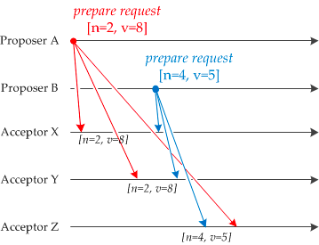

##### Phase 1b: Promise

Когда Acceptors получили номер нового этапа голосования, возможны два исхода:

1. Номер N нового голосования больше, чем номер любого из предыдущих голосований, в котором участвовал Acceptor. Тогда
   Acceptor отправляет Proposer обещание, что не будет больше участвовать ни в каких голосованиях с меньшим номером, чем
   M < N. Если Acceptor уже проголосовал (т.е. он уже во второй фазе принял какое-то значение), то к своему обещанию он
   прикладывает принятое значение и номер голосования N', в котором он участвовал.

   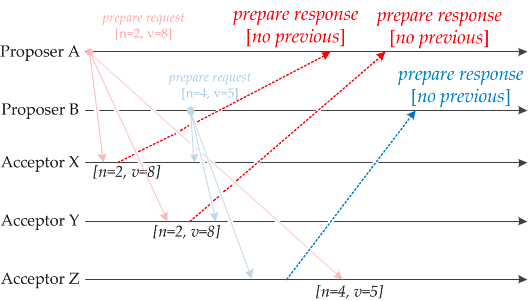

1. В противном случае, если Acceptor уже знает о голосовании с большим номером, он может просто проигнорировать этап
   подготовки и не отвечать лидеру.

   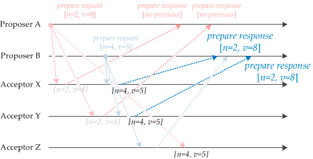

##### Phase 2a: Accept

Лидеру нужно дождаться ответа от кворума (большинства узлов в системе) и, если нужное число ответов получено, то у него
есть два варианта развития событий:

1. Некоторые из Acceptors прислали значения, за которые они уже голосовали. В этом случае лидер выбирает значение из
   голосования с `X = max(N, N', ...)` и рассылает всем узлам сообщение вида: `Accept(N, X)`, где первое значение –
   номер голосования из своего же шага Propose, а второе значение за которое выполняется голосование.

1. Если никто из Acceptors не прислал никаких значений, а просто они пообещали голосовать в этом раунде, лидер может
   предложить им проголосовать за свое значение Y, т.е. то значение, ради которого он вообще стал Proposer. Он рассылает
   всем узлам сообщение вида: `Accept(N, Y)`, по аналогии с предыдущим исходом.

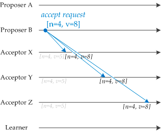

##### Phase 2b: Accepted

Далее Acceptors при получении сообщения `Accept(N, Y)`, от Proposer соглашаются с ним (рассылают всем узлам
подтверждение, что они согласны с новым значением) только в том случае, если они не пообещали какому-то другому Proposer
участвовать в голосованиях с номером раунда N' > N, в противном случае они игнорируют запрос на подтверждение.

Если лидеру ответило большинство узлов, и все они подтвердили новое значение, то новое значение считается принятым. Если
же большинство не набрано или есть узлы, которые отказались принимать новое значение, то всё начинается сначала.

После того, как Paxos принял значение, оно не может быть изменено другими Proposers. Если другой Proposal отправляет
предложение с более высоким номером N' < N, чем было ранее, и другим значением `[N' = 6, V = 8]`, каждый Acceptor
отвечает предыдущеим принятым предложением `[N = 4, V = 8]`. Acceptor получает эту информацию и отправляет
запрос `Accept(N' = 6, V = 8)`, который подтверждает уже выбранное значение. Кроме того, если некоторое меньшинство
Acceptors еще не выбрали значение, этот процесс гарантирует, что они в конечном итоге достигнут консенсуса по этому же
значению.

## Примеры

Для демонстрации развернем кластер из 2 брокеров Kafka и Zookeeper.

```shell
$ git clone git@github.com:Romanow/ansible-kafka.git
$ cd ansible-kafka
```

#### Локальный кластер

```shell
$ cd vagrant
$ vagrant up
$ vagrant status
Current machine states:

zookeeper                 running (virtualbox)
broker1                   running (virtualbox)
broker2                   running (virtualbox)

$ sudo tee -a /etc/hosts > /dev/null << EOT
192.168.51.10     zookeeper.romanow-alex.ru
192.168.51.11     broker-1.romanow-alex.ru
192.168.51.12     broker-2.romanow-alex.ru
EOT

$ ansible-playbook -i inventories/local/static.yml --vault-password-file=.vault_pass kafka.yml -v

PLAY RECAP ***********************************************************************************************************************
192.168.51.10              : ok=12   changed=9    unreachable=0    failed=0    skipped=0    rescued=0    ignored=0   
192.168.51.11              : ok=12   changed=9    unreachable=0    failed=0    skipped=0    rescued=0    ignored=0   
192.168.51.12              : ok=12   changed=9    unreachable=0    failed=0    skipped=0    rescued=0    ignored=0
```

#### Кластер в DigitalOcean

```shell
$ cd terraform
$ terraform apply
Apply complete! Resources: 6 added, 0 changed, 0 destroyed.

Outputs:

instance_ip_addr = [
  "161.35.86.193",
  "161.35.86.247",
  "161.35.86.216",
]

$ export DO_API_TOKEN=<DigitalOcean Token>
$ ansible-playbook -i inventories/digitalocean/digital_ocean.py --vault-password-file=.vault_pass kafka.yml -v

PLAY RECAP ***********************************************************************************************************************
161.35.86.193              : ok=12   changed=9    unreachable=0    failed=0    skipped=0    rescued=0    ignored=0   
161.35.86.216              : ok=12   changed=9    unreachable=0    failed=0    skipped=0    rescued=0    ignored=0   
161.35.86.247              : ok=12   changed=9    unreachable=0    failed=0    skipped=0    rescued=0    ignored=0
```

Работа с Kafka через консольные утилиты:

```shell
$ wget https://archive.apache.org/dist/kafka/2.8.1/kafka_2.12-2.8.1.tgz -O kafka.tgz
$ mkdir kafka && tar zxvf kafka.tgz -C kafka --strip-components 1
$ cd kafka
$ ./kafka-topics.sh --zookeeper zookeeper.romanow-alex.ru:2181 --create --replication-factor 1 --partitions 1 --topic TestTopic
Created topic TestTopic.
$ ./kafka-topics.sh --list --zookeeper zookeeper.romanow-alex.ru:2181
TestTopic
# Из разных терминалов
$ ./kafka-console-producer.sh --bootstrap-server broker-1.romanow-alex.ru:9092,broker-2.romanow-alex.ru:9092 --topic TestTopic
>Hello, world
>Welcome to microservices
>Kafka is the best broker!

$ ./kafka-console-consumer.sh --bootstrap-server broker-1.romanow-alex.ru:9092,broker-2.romanow-alex.ru:9092 --topic TestTopic
Hello, world
Welcome to microservices
Kafka is the best broker!
^CProcessed a total of 3 messages
```

## Литература

1. [Backpressure explained — the resisted flow of data through software](https://medium.com/@jayphelps/backpressure-explained-the-flow-of-data-through-software-2350b3e77ce7)
1. [Backpressure In Message Based Systems](https://clearmeasure.com/backpressure-in-message-based-systems/)
1. [Нужен ли нам JMS в мире современных Java-технологий](https://www.youtube.com/watch?v=ExjPxDxkmFo)
1. [Оркестрируемая сага или как построить бизнес-транзакции в сервисах с паттерном database per service](https://habr.com/ru/company/oleg-bunin/blog/418235/)
1. [Microservices — When to React Vs. Orchestrate](https://medium.com/capital-one-tech/microservices-when-to-react-vs-orchestrate-c6b18308a14c)
1. [Кот Шрёдингера без коробки: проблема консенсуса в распределённых системах](https://habr.com/ru/company/dododev/blog/463469/)
1. [Алгоритм Пакcос. Понятная статья о консенсусе в распределенной системе](https://habr.com/ru/post/346180/)
1. [Как сервера договариваются друг с другом: алгоритм распределённого консенсуса Raft](https://habr.com/ru/company/dododev/blog/469999/)
1. [Paxos By Example](https://medium.com/@angusmacdonald/paxos-by-example-66d934e18522)
1. [Базы данных. Алгоритмы Paxos](https://www.youtube.com/watch?v=mCtxo3b7ows)
1. [RAFT](http://thesecretlivesofdata.com/raft/)