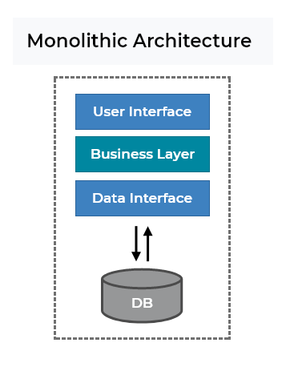
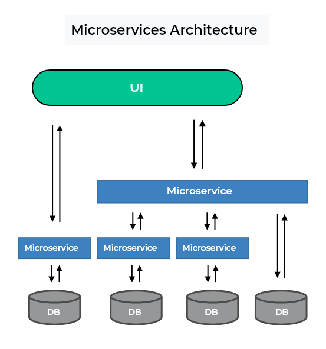
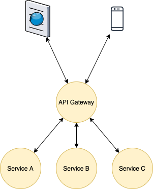
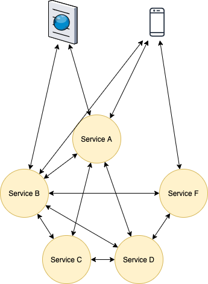

# Введение в РСОИ

## Определение распределенной системы

Существует несколько подходов к определению распределённой системы обработки информации (далее — РСОИ), начиная от
самого общего: любая система, охватывающая несколько взаимодействующих компьютеров. Предметом данного курса является
РСОИ, понимаемая как система взаимодействующих независимых автоматизированных информационных систем (АИС). Такие АИС мы
будем называть далее участниками данной РСОИ. При данном определении РСОИ во главу угла ставиться невозможность для
одной системы получить полностью достоверную информацию о состоянии другой системы на заданный момент времени и
невозможность контролировать полностью её поведение.

### Следствие из определения

1. Каждая информационная система имеет свою логику работы, причём с точки зрения других участников эта логика полностью
   не просматривается, система выглядит как некоторый "чёрный ящик".
1. Обмен информации между участниками распределённой системы происходит по сетевым протоколам через публичные каналы
   доступа.
1. Каждый участник РСОИ имеет свою базу данных, в которых хранит состояние своей модели предметной области. Прямой
   доступ на уровне SQL к этим БД другим участникам невозможен.
1. Невозможно получить достоверное состояние другой системы.
1. Нельзя гарантировать все участники системы работают.

### Требования к распределенной системе

1. **Открытость.** Каждый участник РСОИ должен быть открытым: его сетевой протокол, включая форматы сообщений и
   последовательность обмена ими, должен быть явно специфицирован. В качестве протокола лучше всего использовать
   стандартные платформо-независимые протоколы, работающие на прикладного уровне стека TCP/IP или поверх него.
1. **Надежность.** Функционирование одного участника не должно нарушиться, если другие участники или линии связи не
   работают так, как ожидалось. Соответственно, взаимодействие двух участников не должно нарушаться из-за
   неработоспособности третьего участника. Под "нарушением работы" здесь следует понимать необработанную аварийную
   реакцию, потерю логической целостности данных, вечное ожидание и т. д. Это требование следует из того, что не стоит
   ожидать выполнения каких-либо предположений о работе других участников системы (включая предположения, что участник
   включён и функционирует). Требование надёжности касается так же реакции системы на возможные проблемы с каналами
   связи между участниками:
   их выход из строя в неподходящий момент не должен при- водить к неисправимым нарушениям в целостности данных
   (например, ресурс навсегда остаётся зарезервированным за другим участников, а единственное подтверждение о резерве
   теряется при передаче).
1. **Масштабируемость.** Масштабируемость означает способность системы, сети или процесса справляться с увеличением
   рабочей нагрузки (увеличивать свою производительность) при добавлении ресурсов (обычно аппаратных). Из определения
   следует, что система должна быть спроектирована таким образом, чтобы иметь возможность выдерживать увеличивающуюся
   нагрузку без её переписывания.

## Монолитное приложение, SOA и микросервисы

Монолитная архитектура построения программ представляет из себя единое приложение, объединяющее в себе пользовательский
интерфейс, бизнес-логику и хранение данных (уровень обращения к БД или другому хранилищу).

Сервис-ориентированная архитектура (SOA, англ. service-oriented architecture) — модульный подход к разработке
программного обеспечения, основанный на использовании распределённых, слабо связанных заменяемых компонентов, оснащённых
стандартизированными интерфейсами для взаимодействия по стандартизированным протоколам. Обычное реализуются как некий
набор веб-служб, взаимодействующий друг-с-другом по некоторому протоколу.

Принципы построения SOA:

1. Стандартизированный контракт взаимодействия.
1. Слабая связность между сервисами: сервисы знают только о тех сервисах, которые им нужны в процессе работы.
1. Сервисная абстракция: сервисы предоставляют наружу только API, за которым скрыта вся внутренняя логика работы.
1. Повторное использование сервисов.
1. Сервисы не содержат состояние клиентов: вся информация, требующаяся для выполнения запроса, содержится в самом
   запросе.
1. Автономность: сервисы имеют полный контроль над своей внутренней логикой (предметной областью).

Из этих принципов вытекают плюсы:

* Писать и поддерживать небольшие сервисы всегда проще, чем большие. Поскольку каждый микросервис представляет собой
  отдельный проект, вы можете практически как угодно распределить их между командами разработчиков. Вы можете строить
  иерархии из сервисов. Практически из коробки получаем горизонтально масштабируемый и отказоустойчивый код. При "
  монолитном" же подходе часто в целях оптимизации используется кэширование или другие вещи, приводящие к сохранению
  внутреннего состояния, и в итоге система становится не масштабируемой, т.к. это состояние нужно распределять между
  всеми репликами.
* Горизонтальное масштабирование приводит к экономии денег, так как система может работать на множестве сравнительно
  недорогих машин. Более того, под каждый конкретный микросервис можно подобрать железо подходящей конфигурации.
  Упрощается тестирование, т.к. требуется покрыть тестами лишь покрыть API при этом замокав ответы внешних систем.
* Высокая стабильность: при отказе одного из сервисов, например, из-за программной ошибки, есть возможность откатить
  неработающий сервис или установить новую, более стабильную версию, не перезапуская всего приложения.
* Разнообразие технологий: сервисы не ограничены только одной технологией, принятой для всего приложения.
* Значительно упрощается обновление системы, т.к. для добавления функциональности требуется обновить лишь часть системы,
  что с учетом правильно настроенного деплоя и умением других систем корректно обрабатывать недоступность, становится
  практически незаметно для пользователя.

Звучит все хорошо, но на деле накладываются ограничения:

* Система должна работать быстро, т.к. теперь ко времени выполнения самих операций требуется прибавлять время
  взаимодействия по сети.
* Нужно иметь хорошую систему деплоя и развертывания новых виртуальных машин, т.к. количество сервисов будет расти и
  настройка всего окружения вручную будет проблематична.
* Требуется хорошее описание внешнего API.
* С появлением большого количество сетевого трафика накладывается большая ответственность на сеть и отказоустойчивость
  оборудования.
* В связи с этим, нужно при проектировании программы обязательно обрабатывать недоступность и ошибки от внешней системы.
* Часто становится очень трудно разбить систему на сервисы из-за сильной связанности данных.

**Микросервисная архитектура** — всего лишь набор более строгих правил и соглашений, как писать все те же сервисы SOA.

1. **Сервисы маленькие.** Сервис в микросервисной архитектуре не может разрабатываться больше чем одной командой. Обычно
   одна команда разрабатывает где-то 5 – 6 сервисов. При это каждый сервис решает одну бизнес-задачу, и его способен
   понять один человек. Если же не способен, сервис пора пилить. Потому что, если один человек способен поддерживать всю
   бизнес-логику одного сервиса, он построит действительно эффективное решение. Ведь бывает так, что зачастую люди,
   принимая решения в процессе написания кода, просто-напросто не понимают, что именно делают — не знают, как ведет себя
   система в целом. А если сервис маленький, все намного проще. Этот подход, кстати, мы можем применять отдельно, даже
   не следуя микросервисной архитектуре в целом.
1. **Сфокусированные.** Сервис решает только одну бизнес-задачу, и решает её хорошо. Такой сервис имеет смысл в отрыве
   от остальных сервисов. Другими словами, вы его можете выложить в интернет, дописав security-обертку, и он будет
   приносить людям пользу.
1. **Слабосвязные.** Изменение одного сервиса не требует изменений в другом.
1. **Высокосогласованные.** Класс или компонент содержит все нужные методы решения поставленной задачи. Однако тут часто
   возникает вопрос: чем высокая согласованность (high cohesion) отличается от SRP (Single Responsibility Principe)?
   Допустим, у нас есть класс, отвечающий за управление кухней. В случае SRP такой класс работает только с кухней и
   больше ни с чем, но при этом он может содержать не все методы по управлению кухней. В случае же высокой
   согласованности, все методы по управлению кухней содержатся только в этом классе, и больше нигде. Это важное
   различие.

### Характеристики микросервисов

* Разделение на компоненты (сервисы).
* Группировка по бизнес-задачам.
* Сервисы имеют бизнес-смысл.
* Умные сервисы и простые коммуникации.
* Децентрализованное управление.
* Децентрализованное управление данными.
* Автоматизация развертывания и мониторинга.
* Design for failure.

## Архитектура сервисов

Есть два основных подхода к проектированию сервисов:
**Единый Gateway** – выделяется единая точка входа, gateway, через который выполняется основная маршрутизация запросов.
В зависимости от задачи, он может быть как простым шлюзом с базовым набором задач:

* маршрутизация запросов;
* авторизация;
* логгирование запросов и мониторинг времени выполнения.

так и сложным оркестратором, выполняющим агрегацию запросов и следящим за консистентностью системы. Этот подход
позволяет снять часть служебных функций с каждого участника системы и сконцентрироваться на самой бизнес-задаче.

Каждый сервис имеет всю необходимую и достаточную функциональность. Каждый сервис полностью отвечает за свою
консистентность, знает всех адресатов, необходимых ему для решения своей задачи (через Service Discovery, например) и
полностью инкапсулирует всю логику работы с данными, необходимыми ему для выполнения бизнес-операции, в себе. Основной
недостаток такой архитектуры в том, что со временем может получиться связанность внутри системы все-со-всеми, что, как
следствие, сильно усложняет внедрение новых версий, т.к. для этого требуется обновить каждый клиент.

## Сложности реализации микросервисной архитектруры

* **Сетевая инфраструктура надежная.** Насколько совершенным не было бы оборудование, оно все равно когда-нибудь выйдет
  из строя. И это случится в самый неподходящий момент.
* **Нулевая задержка.** Под задержкой здесь будем понимать время передачи данных из одного места в другое. Возможно,
  временем передачи информации внутри маленького предприятия по гигабитному ethernet-кабелю можно и пренебречь, но как
  только приложение будет работать через внешние сети и интернет, этим значением пренебрегать уже нельзя. Это можно
  прочувствовать на примере: скорость передачи сигнала ограничена скоростью света ~300.000 км/с, таким образом пинг
  между Европой и США (будем считать расстояние равным 9.000 км) будет идти около 30 мс.
* **Бесконечная пропускная способность.** Пропускная способность аппаратуры постоянно растет и сейчас это уже не
  является такой большой проблемой. Тем не менее, если через сервер будет ежедневно проходить поток информации в 1ТБ,
  даже для гигабитного ethernet это будет большой проблемой.
* **Сеть абсолютно безопасна.** Так же в настоящее время не является очень большой проблемой, т.к. сейчас большинство
  операций в интернете работает поверх протокола HTTPS.
* **Топология сети никогда не меняется.** Запросы к сервисам нужно выполнять через их hostname или с помощью Service
  Discovery, т.к. при привязке сервиса к ip, при переезде между серверами ip изменятся и потребуется вручную обновлять
  информацию. DNS же автоматически обновит ip адрес для соответствующего host’а.
* **Сетевой администратор только один.** При разработке сервисов стоит учитывать, что их могут поддерживать
  администраторы с различной квалификацией, со своими внутренними правилами и не находящиеся в зоне действия вашей
  компании.

## Структура микросервисной архитектуры

Чаще всего микросервисная система являет собой трехзвенную архитектуру:

* **Frontend** — первое звено на серверной стороне, которое и начинает предварительную обработку запроса. Обычно он
  представляет собой легковесный веб-сервер (чаще всего nginx или haproxy), разработчики которого сделали все для
  того, чтобы каждый запрос обрабатывался максимально быстро при минимальных затратах ресурсов. Правило простое: там,
  где не нужно отправлять запрос на backend, где не нужно что-либо вычислять (очевидно, что существует класс запросов,
  для обработки которых это не требуется), все должно отдаваться frontend’ом. Отсюда следует области применения
  frontend'а:
    * Отдача статики, картинок, css и js – то есть всего, что не требует вычислений. В конфигурационном файле nginx
      (одно из наиболее удачных решений для фронтенда) вы прописываете, какие именно запросы должны отдаваться с
      локального диска, а какие передаваться дальше.
    * Кэширование. Frontend кеширует ответы от backend’ов в файлы, при этом вы можете настроить и ключ для кеширования
      (включив в него, например, куки пользователя), и множество других параметров для тонкого тюнинга процесса
      кеширования. Соответствующие модули есть у большинства легких веб-серверов. В качестве ключа в этих модулях
      применяется, как правило, смесь URI- и GET-параметров.
    * Балансировка нагрузки между backend’ами, точнее, не столько балансировка, сколько проксирование. При приходе
      запроса на frontend он передает данные на некоторый из N backend’ов, прописанных у него в настройках. Обычно
      backend для обработки запроса ищется по алгоритму round-robin, но есть и умные frontend’ы, учитывающие текущую
      загрузку backend’ов.
* **Backend** – представляют из себя сервера, выполняющие некоторую бизнес логику проекта. Если запрос требует получения
  данных из разных предметных областей, то backend’ы могут взаимодействовать друг с другом.
* **Data Storage** - хранилище данных, при этом нужно строго оговорить, что данные из разных backend’ов(предметных
  областей) должны храниться в разных хранилищах, и к этим хранилищам имеют доступ только backend’ы, к которым они
  принадлежат. Если требуется достать данные из некоторого хранилища, то этим должен заниматься соответствующий backend.

## Структура микросервиса

В типовом виде микросервис состоит из следующих компонентов:
* Подсистема обмена сообщениями:
    * передача сообщений;
    * валидация;
    * фильтрация.
* Подсистема выполнения бизнес-операций.
* Подсистема работы с базой данных.

## Литература

1. [Простым языком о микросервисной архитектуре для начинающих](https://mcs.mail.ru/blog/prostym-jazykom-o-mikroservisnoj-arhitekture)
1. [Микросервисы, скалы и гигантские приложения](https://mcs.mail.ru/blog/mikroservisy-skaly-i-gigantskie-prilozheniya)
1. [Просто о микросервисах](https://habr.com/ru/company/raiffeisenbank/blog/346380/)
1. [Архитектура микросервисов](https://habr.com/ru/company/mailru/blog/320962/) 
1. [Микросервисы или монолит: ищем решение](https://habr.com/ru/post/459810/)