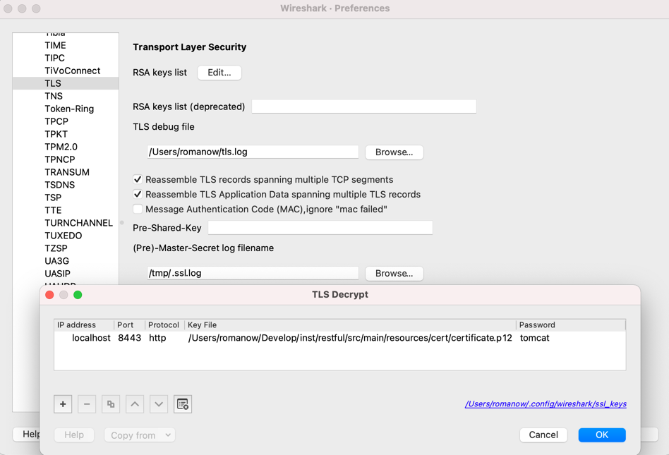

# Wireshark

Общие сведения:

* Операторы: &&, ||, !
* Сравнение: ==, !=, contains, matches (~)

### Capture filters

Фильтр захвата пакетов. Отображается только трафик, удовлетворяющий введенным условиям. Например:

* `host 192.168.1.5` – исходящий или входящий трафик с 192.168.1.5;
* `net 192.168.1.1/16` – исходящий или входящий трафик в подсеть /16;
* `src/dst net 192.168.0.0/24`– явно указать входящий или исходящий трафик;
* `tcp port http` – перехват только HTTP;
* `port 53` – DNS;
* `host www.example.com and not (port 443 or port 25)` – перехват только пакетов, идущий к/от www.example.com и не на
  портах HTTPS или SMTP;
* `tcp portrange 8080-8090` – перехват по диапазону портов.

### Display filters

* `tcp.dstport == 80 && http` – запрос HTTP;
* `tcp.port in {80 8080}` – запросы на порты 80 или 8080 (входящие или исходящие);
* `ip.dst == 192.168.31.1 && arp` – arp запрос к 192.168.31.1;
* `http.host == "example.com"` – запрос к example.com;
* `http.host contains ".com"` – запросы на серверам .com;
* `arp`, `icmp`, http`, `http2` – ARP протокол, ICMP, HTTP/1.1, HTTP/2;
* `http.content_type contains "text/xml"` – content-type text/xml;
* `lower(http.server) contains "apache"` – имя сервера регистронезависимо apache;
* `http.request.method in {"GET", "HEAD"}` – GET / HEAD HTTP methods;
* `http.request.uri matches "/api/v1/server$"` – запросы, оканчивающиеся на /info.

### Follow stream

* Правой кнопкой мыши -> follow HTTP stream.

### Packet reassembly

Wireshark умеет собирать сообщения в общее сообщение:

```
2 reassembled TCP segments:
[Frame 1196, payload: 0-493 (494 bytes)]
[Frame 1238, payload: 494-498 (5 bytes)]
[Segment count: 2]
```

### Расшифровка SSL-трафика

Для расшифровки требуется секретный ключ сервера. Для примера возьмем
проект [restful](https://github.com/Romanow/restful) и запустим его с профилем `local`, `tomcat`.

```shell
docker compose up -d
./gradlew clean build bootRun --args='--spring.profiles.active=local,tomcat'
```

В этой конфигурации основной chipper `TLS_RSA_WITH_AES_256_CBC_SHA`, который для расшифровки требует только ключ
сервера.

Добавить `properties` -> `protocols` -> `TLS` -> `RSA key list` с настройками:

* ip: `127.0.0.1`;
* port: `8443`;
* protocol: `http`;
* keyfile: `resources/certificate.p12`;
* password: `tomcat`.

Так же имеет смысл включить SSL debug file.



В случае ошибки "ssl_restore_master_key can't find pre-master secret by Encrypted pre-master secret", значит при обмене
ключами используется алгоритм Диффи-Хеллмана, которому для расшифровки требуется не только ключ сервера, но и сессионные
ключи из браузера.

Для этого нужно через переменную среды ` SSLKEYLOGFILE` указать путь к файлу, куда будут записываться pre-master ключи.

```shell
SSLKEYLOGFILE=/tmp/.ssl.log curl https://localhost:8443/api/v1/state -k
```

## Ссылки

1. [Building Display Filter Expressions](https://www.wireshark.org/docs/wsug_html_chunked/ChWorkBuildDisplayFilterSection.html)
1. [Filtering while capturing](https://www.wireshark.org/docs/wsug_html_chunked/ChCapCaptureFilterSection.html)
1. [Capture Filters](https://wiki.wireshark.org/CaptureFilters)
1. [HTTP/HTTPS Analysis Using Wireshark](https://medium.com/devops-world/http-https-analysis-using-wireshark-cbe07c23520)
1. [How to Decrypt SSL with Wireshark – HTTPS Decryption Guide](https://www.comparitech.com/net-admin/decrypt-ssl-with-wireshark/)
1. [Reading sniffed SSL/TLS traffic from curl with Wireshark](https://davidhamann.de/2019/08/06/sniffing-ssl-traffic-with-curl-wireshark/)
1. [Unable to decrypt HTTPS traffic with Wireshark](https://osqa-ask.wireshark.org/questions/46959/unable-to-decrypt-https-traffic-with-wireshark)
1. [Анализ SSL/TLS трафика в Wireshark](https://habr.com/ru/company/billing/blog/261301/)