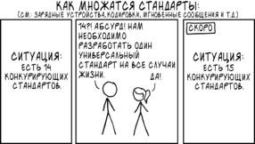
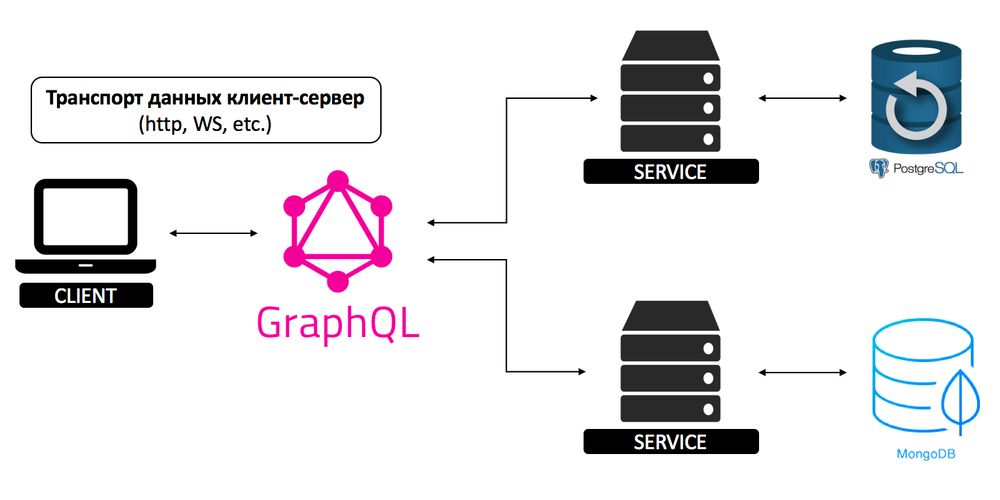

# Протоколы передачи данных

Каналы коммуникации между web-сервисами – это стандратизированные протоколы взаимодействия, постороенные в основном
TCP/IP, в частности поверх HTTP. Стандартизация нужна для упрощения интеграции между системами, т.к. эти протоколы четко
описывают структуру данных и каналы передачи сообщений. На сегодняшний день наибольшее распространение получили
следующие протоколы реализации веб-сервисов:

* SOAP;
* HTTP / REST;
* gRPC;
* GraphQL.

### SOAP

SOAP (Simple Object Access Protocol) – протокол обмена структурированной в виде xml информацией. Обычно передача запроса
осуществляется с помощью POST запроса, но в виде транспорта так же может выступать другой протокол прикладного уровня.
При передаче через HTTP с запросом можно передавать заголовки для Content-Negotiation и использовать другие особенности
протокола.

Фактически SOAP представляет из себя развитие парадигм XML-RPC. Но в отличие от него, SOAP имеет четкую структуру,
описываемую в WSDL (Web Service Definition Language),которая гарантирует простоту общения с клиентами, т.к. по этому
описанию на стороне клиента можно построить прокси-объект для удаленного вызова.

WSDL состоит из пяти логических частей:

1. Определение типов данных (types) — определение вида отправляемых и получаемых сервисом XML-сообщений.
1. Элементы данных (message) — сообщения, используемые web-сервисом.
1. Абстрактные операции (portType) — список операций, которые могут быть выполнены с сообщениями.
1. Связывание сервисов (binding) — способ, которым сообщение будет доставлено.
1. Сервис (services) – содержит само описание вызываемого сервиса

```xml

<wsdl:definitions xmlns:wsdl="http://schemas.xmlsoap.org/wsdl/"
                  xmlns:tns="http://web.soap.protocols.romanow.ru/"
                  xmlns:soap="http://schemas.xmlsoap.org/wsdl/soap/"
                  name="WebServiceDocumentLiteralWrappedImplService"
                  targetNamespace="http://web.soap.protocols.romanow.ru/">
    <wsdl:types>
        <xs:schema xmlns:xs="http://www.w3.org/2001/XMLSchema"
                   xmlns:tns="http://web.soap.protocols.romanow.ru/"
                   targetNamespace="http://web.soap.protocols.romanow.ru/" version="1.0">
            <xs:element name="processRequest" type="tns:processRequest"/>
            <xs:element name="processRequestResponse" type="tns:processRequestResponse"/>
            <xs:complexType name="processRequest">
                <xs:sequence>
                    <xs:element minOccurs="0" name="TestObjectRequest" type="tns:testObjectRequest"/>
                </xs:sequence>
            </xs:complexType>
            <xs:complexType name="testObjectRequest">
                <xs:sequence>
                    <xs:element minOccurs="0" name="id" type="xs:int"/>
                    <xs:element minOccurs="0" name="searchString" type="xs:string"/>
                </xs:sequence>
            </xs:complexType>
            <xs:complexType name="processRequestResponse">
                <xs:sequence>
                    <xs:element minOccurs="0" name="TestObjectResponse" type="tns:testObjectResponse"/>
                </xs:sequence>
            </xs:complexType>
            <xs:complexType name="testObjectResponse">
                <xs:sequence>
                    <xs:element minOccurs="0" name="code" type="xs:int"/>
                    <xs:element minOccurs="0" name="data" type="xs:string"/>
                </xs:sequence>
            </xs:complexType>
        </xs:schema>
    </wsdl:types>
    <wsdl:message name="processRequest">
        <wsdl:part element="tns:processRequest" name="parameters"/>
    </wsdl:message>
    <wsdl:message name="processRequestResponse">
        <wsdl:part element="tns:processRequestResponse" name="parameters"/>
    </wsdl:message>
    <wsdl:portType name="WebServiceDocumentWrapped">
        <wsdl:operation name="processRequest">
            <wsdl:input message="tns:processRequest" name="processRequest"/>
            <wsdl:output message="tns:processRequestResponse" name="processRequestResponse"/>
        </wsdl:operation>
    </wsdl:portType>
    <wsdl:binding name="WebServiceDocumentLiteralWrappedImplServiceSoapBinding" type="tns:WebServiceDocumentWrapped">
        <soap:binding style="document" transport="http://schemas.xmlsoap.org/soap/http"/>
        <wsdl:operation name="processRequest">
            <soap:operation soapAction="" style="document"/>
            <wsdl:input name="processRequest">
                <soap:body use="literal"/>
            </wsdl:input>
            <wsdl:output name="processRequestResponse">
                <soap:body use="literal"/>
            </wsdl:output>
        </wsdl:operation>
    </wsdl:binding>
    <wsdl:service name="WebServiceDocumentLiteralWrappedImplService">
        <wsdl:port binding="tns:WebServiceDocumentLiteralWrappedImplServiceSoapBinding"
                   name="WebServiceDocumentLiteralWrappedImplPort">
            <soap:address location="http://localhost:8880/ws/document-literal-wrapped"/>
        </wsdl:port>
    </wsdl:service>
</wsdl:definitions>
```

По типу описания данных WSDL можно разделить на пять частей: RPC Encoded, RPC Literal, Document Encoded, Document
Literal, Document Literal Wrapped. RPC Encoded и Document Encoded не WS-I совместимы, поэтому не будем останавливаться
на них. Рассмотрим остальные:

##### RPC Literal

В RCP Literal в описании структуры содержится информация об их типах, но при вызове метода она отсутствует в отличие от
RPC Encoded, где она дублировалась.

##### Document Literal

В запросе отсутствует лишняя информация о типах сообщений, вместо это каждый параметр имеет свой тип, описанный в схеме.
Это позволяет легко валидировать сообщение. Имя метода не содержится в описании, без него определение какой нужно
вызвать метод может быть затруднительным.

##### Document Literal Wrapped

Описание очень похоже на RPC Encoded за исключением одной главной особенности: дочерний элемент для body в RPC Encoded
представляет собой операцию, а в Document Literal Wrapped он является обрамляющим элементом, описанным в схеме и имеющий
такое же название как и операция. Предположим, у нас есть перегруженные методы:

```
int sum(int a, int b);
int sum(int a, int b, int c);
```

WSDL позволяет использовать перегруженные метода, но Document Literal Wrapped генерирует обрамляющий элемент с типом
операции, а xml не разрешает иметь два элемента с одинаковыми именами. В этих случаях используется Document Literal.

Так как в Document Literal отсутствует информация об операции, в случае если у нас есть операции с одинаковыми входными
данными следует использовать RPC Literal:

```
int sum(int a, int b);
int sum(int a, int b, int c);
int mult(int a, int b);
```

Сильные стороны SOAP:

* Протокол не привязан конкретному каналу передачи данных и может работать на различных платформах и операционных
  системах.
* Структура запроса автоматически валидируется на этапе его преобразования. А WSDL содержит информацию, достаточную для
  базовой валидации входных данных.
* По WSDL можно легко генерировать прокси-объекты практически на любом языке программирования.
* Существует целое семейство расширений SOAP: WS-Security, WS-Addressing, WS-Trust и т.п. – на которых построены сложные
  корпоративные системы.
* Авторизация и аутентификация может быть реализована через WS-Security либо нативно используя http-авторизацию.
* SOAP имеет все преимущества XML, включая легкую расширяемость посредством добавления namespaces.

Слабые стороны SOAP:

* Очень большой размер сообщений и низкая скорость парсинга XML.
* Автоматическая смена описания веб-сервиса может сломать все клиенты.
* Сложность описания и разрозненные стандарты могут привести к тому, что запрос построенный по описанию с сервера,
  например с помощью axis, будет не читаться сервером. (WebLogic не поддерживает RPC Encoded в котором генерирует запрос
  axis).

### HTTP / REST

REST (Representational State Transfer) — это не стандарт и не спецификация, а архитектурный стиль, выстроенный на
существующих, хорошо известных и контролируемых консорциумом W3C стандартах, таких, как HTTP, URI (Uniform Resource
Identifier), XML и RDF (Resource Description Format). В REST-сервисах акцент сделан на доступ к ресурсам, а не на
исполнение удаленных сервисов; в этом их кардинальное отличие от SOAP-сервисов. И все же удаленный вызов процедур
применим и в REST. Он использует методы PUT, GET, POST, DELETE HTTP протокола для манипуляции объектами. Кардинальное
отличие его от SOAP в том, что REST остается HTTP-запросом.

RESTful строится на принципах:

* Все ресурсы должны иметь уникальный идентефикатор.
* Все операции клиента с сервером stateless, т.е. сервер не должен хранить вообще никакой информации о клиенте – никакой
  сессии.
* Все запросы можно поделить на 4 типа в соответствии с CRUD, причем каждому типу сопоставляется HTTP метод – POST, GET,
  PUT и DELETE. Запрос на получение информации о машине должен выглядеть
  `GET http://www.example.com/cars/00345 вместо getCar?id=00345`.
* Вся логика должна вращаться вокруг ресурсов, а не вокруг операций.
* Одни и те же данные можно вернуть в XML или JSON для программной обработки или обернутыми в красивый дизайн для
  просмотра человеком.

Теперь возникает логичный вопрос: почему REST расшифровывается Representational State Transfer, а в принципах
говориться, что он должен быть stateless? Рой Филдинг (человек, сформулировавший принципы REST) сам объяснял
происхождение названия. Мысль сводится к тому, что запрос ресурса с сервера переводит клиентское приложение в
определенное состояние (state), а запрос следующего ресурса меняет состояние приложения (transfer). А "Representational"
означает то, что ресурс возвращается не просто так, а в каком-то представлении, например в представлении для машины или
в представлении для человека. По русски же наиболее правильно будет сформулировать это как "представление данных в
удобном для клиента формате".

### Разница между REST и SOAP

1. SOAP активно использует XML для кодирования запросов и ответов, а также строгую типизацию данных, гарантирующую их
   целостность при передаче между клиентом и сервером. С другой стороны, запросы и ответы в REST могут передаваться в
   ASCII, XML, JSON или любых других форматах, распознаваемых одновременно и клиентом, и сервером. Кроме того, в модели
   REST отсутствуют встроенные требования к типизации данных. В результате пакеты запросов и ответов в REST имеют
   намного меньшие размеры, чем соответствующие им пакеты SOAP.
1. В модели SOAP уровень передачи данных протокола HTTP является "пассивным наблюдателем", и его роль ограничивается
   передачей запросов SOAP от клиента серверу с использованием метода POST. Детали сервисного запроса, такие как имя
   удаленной процедуры и входные аргументы, кодируются в теле запроса. Архитектура REST, напротив, рассматривает уровень
   передачи данных HTTP как активного участника взаимодействия, используя существующие методы НТТР, такие как GET, POST,
   PUT и DELETE, для обозначения типа запрашиваемого сервиса. Следовательно, с точки зрения разработчика, запросы REST в
   общем случае более просты для формулирования и понимания, так как они используют существующие и хорошо понятные
   интерфейсы HTTP.
1. Модель SOAP поддерживает определенную степень интроспекции, позволяя разработчикам сервиса описывать его API в файле
   формата Web Service Description Language (WSDL, язык описания веб-сервисов). Создавать эти файлы довольно сложно,
   однако это стоит затраченных усилий, поскольку клиенты SOAP могут автоматически получать из этих файлов подробную
   информацию об именах и сигнатурах методов, типах входных и выходных данных и возвращаемых значениях. С другой
   стороны, модель REST избегает сложностей WSDL в угоду более интуитивному интерфейсу, основанному на стандартных
   методах HTTP, описанных выше.
1. В основе REST лежит концепция ресурсов, в то время как SOAP использует интерфейсы, основанные на объектах и методах.
   Интерфейс SOAP может содержать практически неограниченное количество методов; интерфейс REST, напротив, ограничен
   четырьмя возможными операциями, соответствующими четырем методам HTTP.

### gRPC

gRPC (gRPC Remote Procedure Calls) — это высокопроизводительный фреймворк разработанный компанией Google для вызов
удаленных процедур (RPC), работает поверх HTTP/2. Контракт описывается на protobuf версии 3, классы и методы описываются
в .proto-файле. Для запросов используются статические пути - возврат к парадигмам SOAP.



```protobuf
syntax = "proto3";

service TestService {
  rpc SimpleRequest(PingRequest) returns (PingResponse) {};
}

message PingRequest {
  string message = 1;
}

message PingResponse {
  string message = 1;
  Status status = 2;
}

enum Status {
  OK = 0;
  FAIL = 1;
}
```

Типы взаимодействия с потребителями:

* Унарный (Unary RPC). Синхронный запрос клиента, который блокируются пока не будет получен ответ от сервера.
* Серверный стрим (Server streaming RPC), при подключении клиента сервер открывает стрим и начинает отправлять
  сообщения, отправляет статус когда все они отправлены.
* Клиентский стрим (Client streaming RPC). То же самое, что и серверный, только клиент начинает стримить сообщения на
  сервер, а сервер отвечает одним сообщением.
* Двунаправленный стрим (Bidirectional streaming). Клиент инициализирует соединение, создаются два стрима. Сервер может
  отправить изначальные данные при подключении или отвечать на каждый запрос клиента по типу “пинг-понга”.

gRPC предоставляет из коробки балансировку нагрузки, она выполняется на стороне клиента, по-умолчанию round-robin.

### GraphQL

Существует две больших проблемы REST:

* одни и те же данные в разных местах требуют разного представления;
* для получения связанных данные требуется сделать N+1 запрос (нужна информация о пользователе и его заказах: получаем
  пользователя и id заказов, делаем запрос об информации о каждом заказе).

Facebook придумал концептуально простое решение: вместо того, чтобы иметь множество "глупых" endpoint, лучше иметь
один "умный" endpoint, который будет способен работать со сложными запросами и придавать данным такую форму, какую
запрашивает клиент.

Фактически, слой GraphQL находится между клиентом и одним или несколькими источниками данных; он принимает запросы
клиентов и возвращает необходимые данные в соответствии с переданными инструкциями.



GraphQL построен на трех концепциях:

1. schema – описание структуры данных и операций над ними;
1. queries – получение информации;
1. resolvers – методы получения данных.

Одной из основных фичей GraphQL является то, что структура и обьем данных определяется клиентским приложением. Запросы
делается на 3 вида:

1. query – запрос данных;
1. mutation – изменения данных;
1. subscription – подписка на данные, т.е. клиент асинхронно получает новые данные без дополнительных запросов.

Клиент точно указывает, какие данные он хочет получить, используя декларативную, графо-подобную структуру, которая очень
напоминает формат JSON.

GraphQL является дополнительным слоем между клиентом и сервером. В случае, если в проекте используется несколько
источников данных, то все становится на свои места: GraphQL фактически выполняет функцию API gateway. Транспорт данных
клиент-сервер может выполнятся с помощью любого протокола (HTTP, WebSocket). Клиент запрашивает ресурсы у
GraphQL сервера, сервер анализирует запрос, рекурсивно проходит по графу и выполняет для каждого поля его "resolver"
функцию. Когда все данные по запросу будут собраны, GraphQL сервер вернет ответ. Важно отметить, что добавление нового
сервиса не влияет на существующее приложение. За счет того, что клиент определяет, какие данные он хочет получить, можно
не боясь расширять существующие типы.

## Примеры

[Web Protocols](https://github.com/Romanow/web-protocols)

## Литература

1. [Which style of WSDL should I use?](https://developer.ibm.com/articles/ws-whichwsdl/)
1. [Core concepts, architecture and lifecycle](https://grpc.io/docs/what-is-grpc/core-concepts/)
1. [GraphQL — новый взгляд на API](https://fwdays.com/en/event/js-fwdays-2018/review/graphql-new-look-on-api)
1. [GraphQL — API по-новому](https://www.youtube.com/watch?v=YgRmgHPTXr4)
1. [So what’s this GraphQL thing I keep hearing about?](https://www.freecodecamp.org/news/so-whats-this-graphql-thing-i-keep-hearing-about-baf4d36c20cf/)
1. [Introduction to GraphQL](https://graphql.org/learn/)