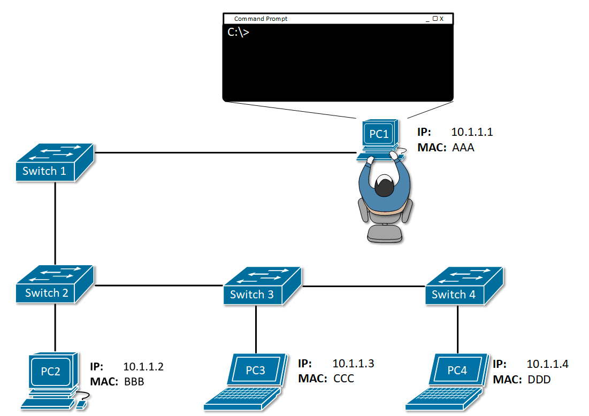

# Сети

## Типы сетевых устройств

* **Hub** – многопортовый повторитель, он рассылает входящий сигнал по всем остальным портам.
* **Bridge (Мост)** – устройство, предназначавшееся для объединения сегментов подсети в единую сеть. Сетевой мост
  работает на канальном уровне сетевой модели OSI, при получении из сети кадра сверяет MAC-адрес назначения последнего
  и, если он принадлежит данной подсети, передаёт кадр дальше в тот сегмент, которому предназначался данный кадр; если
  кадр не принадлежит данной подсети, мост ничего не делает.
* **Switch (Коммутатор)** – хранит в памяти таблицу коммутации, в которой указывается соответствие MAC-адреса узла порту
  коммутатора. При включении коммутатора эта таблица пуста, и он работает в режиме обучения. В этом режиме поступающие
  на какой-либо порт данные передаются на все остальные порты коммутатора. При этом коммутатор анализирует фреймы (
  кадры) и, определив MAC-адрес хоста-отправителя, заносит его в таблицу на некоторое время. Впоследствии, если на один
  из портов коммутатора поступит кадр, предназначенный для хоста, MAC-адрес которого уже есть в таблице, то этот кадр
  будет передан только через порт, указанный в таблице. Если MAC-адрес хоста-получателя не ассоциирован с каким-либо
  портом коммутатора, то кадр будет отправлен на все порты, за исключением того порта, с которого он был получен. Со
  временем коммутатор строит таблицу для всех активных MAC-адресов, в результате трафик локализуется.
* **Router (Маршрутизатор)** — это устройство, предназначенное для пересылки пакетов из одной канальной среды в другую.
  Работает на Сетевом уровне модели OSI. Маршрутизатор использует адрес получателя, указанный в заголовке пакета, и
  определяет по таблице маршрутизации путь, по которому следует передать данные. Если в таблице маршрутизации для адреса
  нет описанного маршрута — пакет отбрасывается. Таблица маршрутизации содержит информацию, на основе которой
  маршрутизатор принимает решение о дальнейшей пересылке пакетов. Таблица состоит из некоторого числа записей —
  маршрутов, в каждой из которых содержится идентификатор сети получателя (состоящий из адреса и маски сети), адрес
  следующего узла, которому следует передавать пакеты.

## Модель взаимодействия TCP

### Модель OSI

Для единого представления данных в сетях с неоднородными устройствами и программным обеспечением международная
организация по стандартам ISO (International Standardization Organization) разработала базовую модель связи открытых
систем OSI (Open System Interconnection). Эта модель описывает правила и процедуры передачи данных в различных сетевых
средах при организации сеанса связи. Основными элементами модели являются уровни, прикладные процессы и физические
средства соединения.

Каждый уровень модели OSI выполняет определенную задачу в процессе передачи данных по сети. Базовая модель является
основой для разработки сетевых протоколов. OSI разделяет коммуникационные функции в сети на семь уровней, каждый из
которых обслуживает различные части процесса области взаимодействия открытых систем. Модель OSI описывает только
системные средства взаимодействия, не касаясь приложений конечных пользователей. Приложения реализуют свои собственные
протоколы взаимодействия, обращаясь к системным средствам.

Сетевая модель OSI состоит из 7 уровней, причем принято начинать отсчёт с нижнего:

* **Прикладной уровень (Application Layer)** - осуществляет связь пользовательских приложений с сетью. На этом уровне
  работают протоколы HTTP, FTP, SMTP, Telnet.
* **Уровень представления (Presentation Layer)** - преобразует данные в соответствующий формат. Фактически - это уровень
  работы с протоколами (стандартами) изображений (JPEG, GIF, PNG, TIFF), кодировок (ASCII, EBDIC), музыки и видео (MPEG)
  и т.д.
* **Сеансовый уровень (Session Layer)** - это уровень, определяющий процедуру проведения сеансов между пользователями
  или прикладными процессами. Этот уровень управляет передачей информации между прикладными процессами, координирует
  прием, передачу и выдачу одного сеанса связи.
* **Транспортный уровень (Transport Layer)** - этот уровень предназначен для передачи пакетов через коммуникационную
  сеть, на нем пакеты разбиваются на блоки. Транспортный уровень определяет адресацию физических устройств (систем, их
  частей) в сети. Этот уровень гарантирует доставку блоков информации адресатам и управляет этой доставкой. Его главной
  задачей является обеспечение эффективных, удобных и надежных форм передачи информации между системами. Когда в
  процессе обработки находится более одного пакета, транспортный уровень контролирует очередность прохождения пакетов.
  Если проходит дубликат принятого ранее сообщения, то данный уровень опознает это и игнорирует сообщение. На этом
  уровне работают протоколы TCP (Transmission Control Protocol), UDP (User Datagram Protocol), NCP (Network Control
  Protocol).
* **Сетевой уровень (Network Layer)** - этот уровень обеспечивает прокладку каналов, соединяющих абонентские и
  административные системы через коммуникационную сеть, выбор маршрута наиболее быстрого и надежного пути. Сетевой
  уровень устанавливает связь в вычислительной сети между двумя системами и обеспечивает прокладку виртуальных каналов
  между ними. Сообщения сетевого уровня принято называть пакетами (packet), в них помещаются фрагменты данных. Сетевой
  уровень отвечает за их адресацию и доставку. На этом уровне работают протоколы IP (IPv4, IPv6), ICMP (Internet Control
  Message Protocol - ping).
* **Канальный уровень (Data Link Layer)** обеспечивает корректность передачи каждого кадра, помещая специальную
  последовательность бит, в начало и конец каждого кадра, чтобы отметить его, а также вычисляет контрольную сумму,
  суммируя все байты кадра определенным способом и добавляя контрольную сумму к кадру. Когда кадр приходит, получатель
  снова вычисляет контрольную сумму полученных данных и сравнивает результат с контрольной суммой из кадра. Если они
  совпадают, кадр считается правильным и принимается. Если же контрольные суммы не совпадают, то фиксируется ошибка.
  Задача канального уровня – брать пакеты, поступающие с сетевого уровня и готовить их к передаче, укладывая в кадр
  соответствующего размера. Этот уровень обязан определить, где начинается и где заканчивается блок, а также
  обнаруживать ошибки передачи. На этом уровне работают протоколы Ethernet, FDDI (Fiber Distributed Data Interface),
  IEEE 802.11, Wi-Fi, PPP (Point-to-Point Protocol), PPPoE (Point-to-Point Protocol over Ethernet).
* **Физический уровень (Physical Layer)** - этот уровень описывает способы передачи бит (а не пакетов данных) через
  физические среды линий связи, соединяющие сетевые устройства. На этом уровне описываются параметры сигналов, такие как
  амплитуда и частота, используемая модуляция и другие низкоуровневые параметры.

### Канальный уровень

Он включает в себя Физический и Канальный уровни модели OSI.

Задача физического уровня – представить биты в виде сигналов, передаваемых по среде.

Задача канального уровня – передача сообщений по каналам связи – кадров, т.е. определение где в сообщении начало, где
конец. На канальном уровне работает Ethernet и Wi-Fi. Этот уровень делится на два подуровня:

* Подуровень управления доступом к серее (MAC): на этом подуровне находится MAC-адрес – идентификатор компьютера в
  канальной среде. С помощью MAC-адресов выполняется передача данных на канале, это идентификатор компьютера в среде.
* Подуровень управления логической связью: на этом подуровне производится обнаружение и исправление ошибок переданных
  данных.

#### ARP (Address Resolution Protocol)

ARP (протокол определения адреса) – протокол в компьютерных сетях, предназначенный для определения MAC-адреса по
IP-адресу другого компьютера. Работает на канальном уровне. Алгоритм работы:

1. Узел, которому нужно выполнить отображение IP-адреса на локальный адрес, формирует ARP-запрос, вкладывает его в кадр
   протокола канального уровня, указывая в нем известный IP-адрес, и рассылает запрос широковещательно (`ff:ff:ff:ff:ff:
   ff`).
1. Все узлы локальной сети получают ARP-запрос и сравнивают указанный там IP-адрес с собственным.
1. В случае их совпадения узел формирует ARP-ответ, в котором указывает свой IP-адрес и свой локальный адрес и
   отправляет его уже направленно, так как в ARP-запросе отправитель указывает свой локальный адрес.

Из-за того, что ARP находится ниже сетевого уровня, ARP запросы не могут пройти через маршрутизатор, т.е. с помощью
этого протокола можно узнать только IP-адреса компьютеров, находящихся в одной подсети.

Если запрашиваемый ip адрес находится вне текущей сети, то запрос направляется на шлюз (
быть может так же запрашивая его MAC-адрес по протоколу ARP). При запросе ip-адреса вне текущей сети ставится MAC-адрес
маршрутизатора, но ip адрес получателя остается.

Протокол ARP может использоваться для обнаружения конфликтов IP-адресов в локальной сети. RFC 5227 определяет формат
запроса 'ARP Probe' с полем SPA, состоящим из всех нулей (ip-адрес `0.0.0.0`)
. `0.0.0.0` используется, чтобы системы не сбрасывали свои ARP-кэши. Перед использованием IP-адреса хост может
проверить, что данный IP-адрес не используется другим хостом сегмента локальной сети.

#### STP (Spanning Tree Protocol)

Для обеспечения отказоустойчивости из одной сети до другой можно добраться разными путями, т.е. в сети появляются петли.
Петля коммутации — состояние в сети, при котором происходит бесконечная пересылка фреймов между коммутаторами,
подключенными в один и тот же сегмент сети. Необходимость устранения топологических петель в сети Ethernet следует из
того, что их наличие в реальной сети Ethernet с коммутатором с высокой вероятностью приводит к бесконечным повторам
передачи одних и тех же кадров Ethernet одним и более коммутатором, отчего пропускная способность сети оказывается почти
полностью занятой этими бесполезными повторами. В этих условиях, хотя формально сеть может продолжать работать, на
практике её производительность становится настолько низкой, что может выглядеть как полный отказ сети.

STP (протокол покрывающего дерева) — канальный протокол. Основной задачей STP является устранение петель в топологии
произвольной сети Ethernet, в которой есть один или более сетевых мостов, связанных избыточными соединениями. STP решает
эту задачу, автоматически блокируя соединения, которые в данный момент для полной связности коммутаторов являются
избыточными. Алгоритм остовного дерева является основой протокола, динамически отключающего избыточные связи в сети
стандарта Ethernet (для образования древовидной топологии).

Суть работы протокола заключается в том, что поддерживающие его коммутаторы сети Ethernet обмениваются друг с другом
информацией о себе. На основании определённых условий (обычно в соответствии с настройками) один из коммутаторов
выбирается корневым (root), после чего все остальные коммутаторы по алгоритму остовного дерева выбирают для работы
порты, "ближайшие" к корневому коммутатору (учитывается количество посредников и скорость линий). Все прочие сетевые
порты, ведущие к корневому коммутатору, блокируются. Таким образом образуется несвязное дерево с корнем в выбранном
коммутаторе.

Алгоритм работы:

1. После включения коммутаторов в сеть по умолчанию каждый коммутатор считает себя корневым (root).
1. Каждый коммутатор начинает посылать по всем портам конфигурационные `Hello BPDU` пакеты раз в 2 секунды.
1. Если мост получает `BPDU` с идентификатором моста (`Bridge ID`) меньшим, чем свой собственный, он прекращает
   генерировать свои `BPDU` и начинает ретранслировать `BPDU` с этим идентификатором. Таким образом, в конце концов в
   этой сети Ethernet остаётся только один мост, который продолжает генерировать и передавать собственные `BPDU`. Он и
   становится корневым мостом (root bridge).
1. Остальные мосты ретранслируют `BPDU` корневого моста, добавляя в них собственный идентификатор и увеличивая счётчик
   стоимости пути (path cost).
1. Для каждого сегмента сети, к которому присоединено два и более портов мостов, происходит определение designated port
   — порта, через который `BPDU`, приходящие от корневого моста, попадают в этот сегмент.
1. После этого все порты в сегментах, к которым присоединено 2 и более портов моста, блокируются за исключением root
   port и designated port.
1. Корневой мост продолжает посылать свои `Hello BPDU` раз в 2 секунды.

Каждый порт, задействованный в STP, может работать в одном из следующих режимов:

1. Root Port (корневой) — порт для передачи трафика корневому коммутатору. Каждый некорневой коммутатор имеет только
   один корневой порт, выбранный из соображений минимальной стоимости пути.
1. Designated Port (назначенный) — некорневой порт моста между сегментами сети, принимающий трафик из соответствующего
   сегмента. Сам мост также называется назначенным. В каждом сегменте сети может быть только один назначенный порт. У
   корневого коммутатора все порты — назначенные.
1. Non-designated Port (неназначенный) — порт, не являющийся корневым, или назначенным. Передача фреймов данных через
   такой порт запрещена.
1. Disabled Port (отключённый) — порт, не участвующий в STP, либо выключенный административно (командой shutdown).

### Сетевой уровень

На этом уровне выполняется объединение различных подсетей, построенных по различным технологиям, выполняется
согласование:

* Кадры из Wi-Fi принимаются с отправкой подтверждения, а Ethernet без;
* Глобаные адреса, не зависящие от конкретных технологий (в Ethernet / Wi-Fi MAC-адреса, в GSM IMEI);
* Методы преобразования локального адреса в глобальный (ARP протокол);
* Согласование размера кадра (если размер различный, то кадры фрагментируются, а потом снова склеиваются).

Построить сеть по протоколу Ethernet нельзя:

* таблица коммутации будет просто огромной;
* ARP-запросы заполонят весь интеренет.

Масштабируемость на сетевом уровне:

* работа с блоками адресов (подсетями);
* пакет отбрасывается, если нельзя определить куда его нужно отправить;
* возможность наличия нескольких путей в сети.

Определение пути выполняется делится на два этапа: изучение сети и продвижение пакета.

#### Изучение сети

##### RIP (routing information protocol)

RIP (протокол маршрутной информации) — так называемый протокол дистанционно-векторной маршрутизации, который оперирует
транзитными участками (hop) в качестве метрики маршрутизации. Максимальное количество транзитных участков, разрешенное в
RIP — 15 (метрика 16 означает "бесконечно большую метрику"). Каждый RIP-маршрутизатор по умолчанию вещает в сеть свою
полную таблицу маршрутизации раз в 30 секунд, довольно сильно нагружая низкоскоростные линии связи. RIP работает в сетях
TCP/IP, используя UDP порт 520.

Алгоритм:

1. В этом протоколе все сети имеют номера (способ образования номера зависит от используемого в сети протокола сетевого
   уровня), а все маршрутизаторы - идентификаторы.
1. В начальный момент времени маршрутизатор имеет информацию только о подключенных к нему маршрутизаторах сети.
1. Маршрутизатор рассылает информацию о таблице маршрутизации соседним маршрутизаторам и так же получает от них эту
   информацию.
1. Если в сообщении от соседей есть новая информация, то он заносит эту информацию в свою таблицу маршрутизации.

Проблемы RIP. Предпложим, что вышел из стоя канал между маршрутизатором C и сетью 3. Маршрутизатор обнаружит эту
проблему и удалить из своей таблицы маршрут до 3. При этом маршрутизатор B в это время может прислать анонс маршрута до
3 с длиной 1 (т.е. через маршрутизатор C, но C об этом не знает). Маршрутизатор C запишет в свою таблицу маршрут через B
с длиной 1 и отправит анонс на B. B увидит, что маршрут через C изменился с 1 на 2 и перезапишет в своей таблице маршрут
через C с 1 на 2. И отправит это обратно на C. C в свою очередь перезапишет маршрут через B с 1 на 3 и так далее. В
итоге маршрут будет удален только в тот момент, когда счет достигнет 16. При этом пакеты будут ходить туда B и C.

Для предотвращения такого поведения в IP есть время жизни пакета, так же:

* Split horizon – не отправлять информацию о сети на тот интерфейс, откуда пришел запрос;
* Route poisoning – при обнаружении недоступности, сообщить о его недоступности, отправив расстояние 16;
* HoldDown – таймер на изменение записей о недоступности маршрута, т.е. какое-то время мы игнорируем анонсы о новом
  маршруте к недоступной сети.

##### OSPF (Open Shortest Path First)

OSPF (протокол динамической маршрутизации), основанный на технологии отслеживания состояния канала (link-state
technology) и использующий для нахождения кратчайшего пути алгоритм Дейкстры.

Алгоритм:

1. После включения маршрутизаторов протокол ищет непосредственно подключенных соседей и устанавливает с ними “дружеские”
   отношения.1
1. Затем они обмениваются друг с другом информацией о подключенных и доступных им сетях. То есть они строят карту сети (
   топологию сети). Данная карта одинакова на всех маршрутизаторах.
1. Каждой связи признается свой вес. За вес принимается пропускная способность и, возможно, особенности сети (канал
   быстрый, но передача больших объемов данных по нему дорогая).
1. На основе полученной информации запускается алгоритм выбора оптимального маршрут к каждой сети во взвешенном графе.
1. После построения маршрутов каждый маршрутизатор раз в 10 секунд рассылает сообщение HELLO для того, чтобы проверить
   их доступность и работоспособность. В ответ маршрутизатор тоже ожидает получить HELLO, и, если, в течении 40 секунд
   ответ не пришел, то маршрутизатор считается недоступным, и в сети рассылается информация о его недоступности. После
   этого снова производится перерасчет стоимости маршрутов в сети и формируется новые таблицы маршрутизации.

Если каждый маршрутизатор будет собирать полную информацию о сети, то это займет много времени и потребует большого
количества траффика в сети. Поэтому в OSPF есть такое понятие как Designated router (DR, выделенный маршрутизатор) –
управляет процессом рассылки информации о состоянии канала в сети. Каждый маршрутизатор сети устанавливает отношения
соседства с DR. Информация об изменениях в сети отправляется DR, маршрутизатором обнаружившим это изменение, а DR
отвечает за то, чтобы эта информация была отправлена остальным маршрутизаторам сети. При выходе его из строя должен быть
выбран новый DR. Новые отношения соседства должны быть сформированы и, пока базы данных маршрутизаторов не
синхронизируются с базой данных нового DR, сеть будет недоступна для пересылки пакетов. Для устранения этого недостатка
выбирается Backup designated router (BDR, резервный выделенный маршрутизатор). Каждый маршрутизатор сети устанавливает
отношения соседства не только с DR, но и BDR. DR и BDR также устанавливают отношения соседства и между собой. При выходе
из строя DR, BDR становится DR и выполняет все его функции. Так как маршрутизаторы сети установили отношения соседства с
BDR, то время недоступности сети минимизируется.

##### BGP (Border Gateway Protocol)

OSPF прекрасно работает в любой сети, однако, если сеть большая, то необходимо разделить ее на зоны.

Представим сеть, состоящую из 100 и более маршрутизаторов. Каждый маршрутизатор должен хранить в базе данных полную
информацию о подключенных маршрутизаторах и интерфейсах всей сети. Кроме того, алгоритм SPF требует значительных
ресурсов памяти и процессора. Чтобы уменьшить нагрузку на сеть и маршрутизаторы протоколом OSPF предусмотрено разделение
сети на зоны. Маршрутизаторы одной зоны не знают топологию сети другой зоны, то есть не получают обновления с другой
зоны и таким образом уменьшается нагрузка на маршрутизатор.

В OSPF зона 0 (Area 0) всегда является магистральной (backbone), к которой подключаются остальные зоны. Связь между
зонами всегда осуществляется только через магистральную зону. Существует несколько видов зон:

* Backbone (магистральная) – отвечает за межзональную маршрутизацию. Все остальные зоны соединены с ней, и межзональная
  маршрутизация происходит через маршрутизатор соединенный с магистральной зоной.
* Standard (обычная) – может содержать пограничные маршрутизаторы зоны ABR (Area Border Router (пограничный
  маршрутизатор) – включается на стыке 2-х и более зон) и пограничные маршрутизаторы автономной системы ASBR (AS
  Boundary router - подключается на стыке разных автономных систем), то есть может подключаться к другим автономным
  системам.
* Stub (тупиковая) – не принимает анонсы о внешних сетях всей автономной зоны, однако принимает анонсы о других зонах.
  Маршрут к внешним сетям заменен на маршрут по умолчанию. Не может иметь ASBR маршрутизатор, то есть не подключается к
  другим автономным сетям.

Автономная система (autonomous system) — это совокупность сетей под единым административным управлением, обеспечивающим
общую для всех входящих в автономную систему маршрутизаторов политику маршрутизации. Обычно автономной системой
управляет один поставщик услуг Интернет. Автономная система использует внутренние шлюзовые протоколы IGP (RIP, OSPF и
т.п.).

BGP (протокол граничного шлюза) – единый протокол динамической маршрутизации между автономными системами. В обычной
ситуации, когда вы подключаетесь к провайдеру, он выдаёт вам диапазон публичных адресов – так называемые PA-адреса (
Provider Aggregatable). Получить их – раз плюнуть, но если вы не являетесь LIR’ом, то при смене провайдера придётся
возвращать и PA-адреса. Тем более фактически допускается подключение только к одному провайдеру. И если вы решите
сменить провайдера, то старые адреса уйдут вместе с ним, а новый провайдер выдаст новые. У LIR вы можете приобрести
повайдеро-независимый блок адресов (PI) и обязательно ASN. В нашем случае пусть это будет блок 100.0.0.0/23, который мы
будем анонсировать по BGP своим соседям. И эти адреса уже чисто наши и никакие провайдеры нам не страшны: не понравился
один – ушли к другому с сохранением своих адресов.

Задача протокола BGP – вычисление маршрута между целыми автономными системами. Протокол для построения маршрутов
использует дистанционно-векторный протокол, при этом маршрутизаторы обмениваются с соседями информацией о доступным им
автономных системах. В информации о маршруте передаются три части:

* информация об автономной системе (один или несколько префиксов сетей);
* вектор пути – список промежуточных автономных систем;
* следующий маршрутизатор (указывается потому что для доступа между автономными системами может использоваться больше
  одного маршрутизатора).

Для надежности передачи данных используется протокол TCP (порт 179).

В BGP не возникает петель, т.к. В сообщение содержится путь через автономные системы.

##### Маршрутизация

Таблица маршрутизации роутера выглядит следующим образом:

Если информации о достижимости нет в таблице, то пакет просто отбрасывается. IP состоит из адреса, маски подсети и
адреса шлюза. Шлюз используется если запрашиваемый адрес находится вне подсети.

При передаче данных между сетями MAC-адрес устанавливается в MAC-адрес маршрутизатора, а dest IP в реальный адрес
получателя.