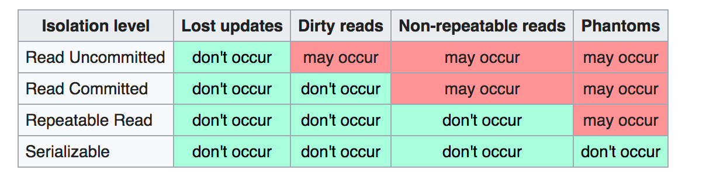
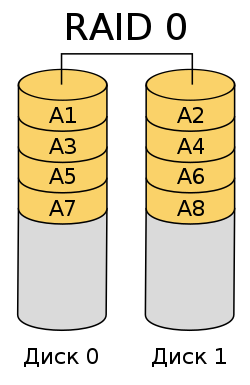
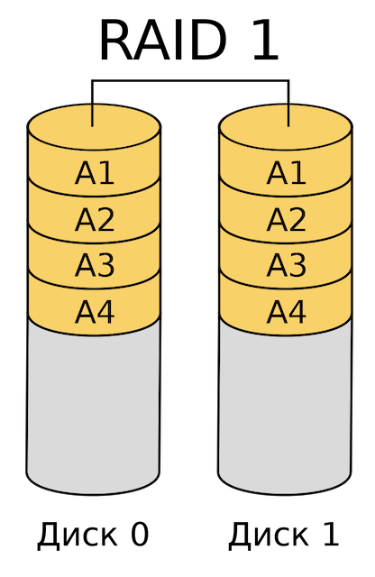
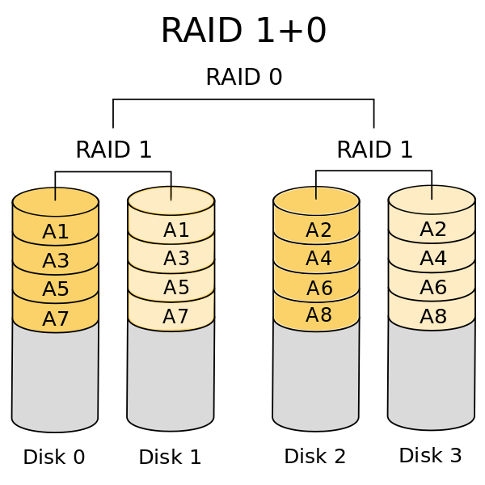
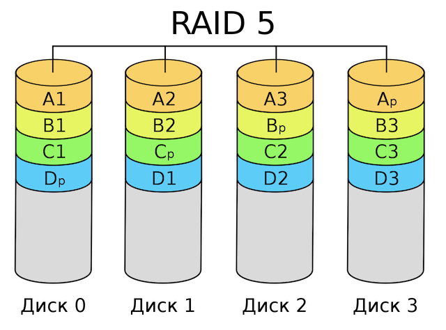
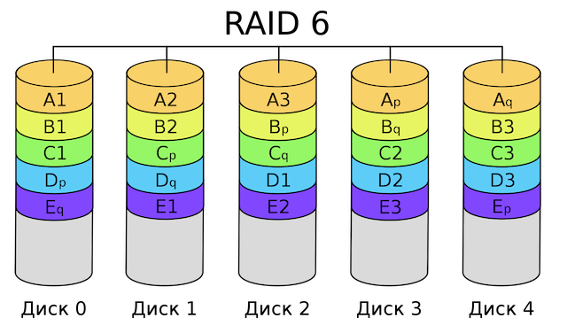
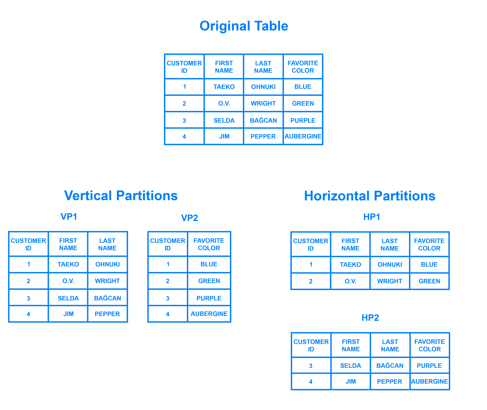

# Хранение данных

## Транзакции

Транзакция — группа последовательных операций с базой данных, которая представляет собой логическую единицу работы с
данными. Транзакция может быть выполнена либо целиком и успешно, соблюдая целостность данных и независимо от параллельно
идущих других транзакций, либо не выполнена вообще, и тогда она не должна произвести никакого эффекта. Транзакция
считается успешно выполненной если все операции, содержащиеся внутри транзакции, выполнены успешно.

##### Атомарность (Atomicity)

Атоматрность гарантирует, что никакая транзакция не будет зафиксирована в системе частично. Будут либо выполнены все
операции внутри транзакции, либо не выполнено ни одной.

##### Согласованность (Consistency)

Транзакция, достигающая своего нормального завершения и, тем самым, фиксирующая свои результаты, сохраняет
согласованность базы данных. Другими словами, каждая успешная транзакция по определению фиксирует только допустимые
результаты. В ходе выполнения самой транзакции согласованность не требуется в силу требования атомарности –
неконсистентные данные не будут видны никому другому.

##### Изолированность (Isolation)

Изолированность гарантирует что никакой поток данных не может читать данные из еще не завершенной транзакции. Если две
транзакции выполняются одновременно, каждая транзакция будет выглядеть так, как будто они выполняются последовательно.
Если одной транзакции нужно прочитать данные, изменяемые другой транзакцией, то она будет ожидать её завершения.

##### Долговечность (Durability)

Долговченость означает что если транзакция завершена, то все данные записаны на диск.

Уровень изолированности транзакций — значение, определяющее уровень, при котором в транзакции допускаются
несогласованные данные, то есть степень изолированности одной транзакции от другой. Более высокий уровень
изолированности повышает точность данных, но при этом может снижаться количество параллельно выполняемых транзакций.

Побочные эффекты параллелизма:

##### Потерянное обновление (Lost Update)

Ситуация, когда при одновременном изменении одного блока данных разными транзакциями одно из изменений теряется.

|                 Транзакция 1                 |                  Транзакция 2               |
| -------------------------------------------- | ------------------------------------------- |
| UPDATE table1 SET f2 = f2 + 20 WHERE f1 = 1; | UPDATE table1 SET f2 = f2 + 5 WHERE f1 = 1; | 

В обеих транзакциях изменяется значение поля `f2`, по их завершении значение поля должно быть увеличено на 45. В
действительности может возникнуть следующая последовательность действий:

* Обе транзакции одновременно читают текущее состояние поля. Точная физическая одновременность здесь не обязательна,
  достаточно, чтобы вторая по порядку операция чтения выполнилась до того, как другая транзакция запишет свой результат.
* Обе транзакции вычисляют новое значение поля, прибавляя, соответственно, 20 и 25 к ранее прочитанному значению.
* Транзакции пытаются записать результат вычислений обратно в поле `f2`. Поскольку физически одновременно две записи
  выполнить невозможно, в реальности одна из операций записи будет выполнена раньше, другая позже. При этом вторая
  операция записи перезапишет результат первой. В результате значение поля `f2` по завершении обеих транзакций может
  увеличиться не на 45, а на 20 или 25, то есть одна из изменяющих данные транзакций потеряется.

##### Грязное чтение (Dirty Read)

Чтение данных, добавленных или изменённых транзакцией, которая впоследствии не подтвердится (откатится).

|            Транзакция 1                     |            Транзакция 2             |
| ------------------------------------------- | ----------------------------------- |
| UPDATE table1 SET f2 = f2 + 1 WHERE f1 = 1; |                                     |
|                                             | SELECT f2 FROM table1 WHERE f1 = 1; |
| ROLLBACK;                                   |                                     |

В транзакции 1 изменяется значение поля f2, а затем в транзакции 2 выбирается значение этого поля. После этого
происходит откат транзакции 1. В результате значение, полученное второй транзакцией, будет отличаться от значения,
хранимого в базе данных.

##### Неповторяющееся чтение (Non-repeatable Read)

Ситуация, когда при повторном чтении в рамках одной транзакции ранее прочитанные данныеоказываются изменёнными.

|            Транзакция 1                     |            Транзакция 2             |
| ------------------------------------------- | ----------------------------------- |
|                                             | SELECT f2 FROM table1 WHERE f1 = 1; |
| UPDATE table1 SET f2 = f2 + 1 WHERE f1 = 1; |                                     |
| COMMIT;                                     |                                     |
|                                             | SELECT f2 FROM table1 WHERE f1 = 1; |

В транзакции 2 выбирается значение поля `f2`, затем в транзакции 1 изменяется значение поля `f2`. При повторной попытке
выбора значения из поля `f2` в транзакции 2 будет получен другой результат. Эта ситуация особенно неприемлема, когда
данные считываются с целью их частичного изменения и обратной записи в базу данных.

##### Фантомное чтение (Phantom Reads)

Ситуация, когда при повторном чтении в рамках одной транзакции одна и та же выборка дает разные множества строк.

|            Транзакция 1                  |       Транзакция 2          |
| ---------------------------------------- | --------------------------- |
|                                          | SELECT SUM(f2) FROM table1; |
| INSERT INTO tbl1 (f1,f2) VALUES (15,20); |                             |
| COMMIT;                                  |                             |
|                                          | SELECT SUM(f2) FROM table1; |

В транзакции 2 выполняется SQL-оператор, использующий все значения поля `f2`. Затем в транзакции 1 выполняется вставка
новой строки, приводящая к тому, что повторное выполнение SQL-оператора в транзакции 2 выдаст другой результат. Такая
ситуация называется фантомным чтением. От неповторяющегося чтения оно отличается тем, что результат повторного обращения
к данным изменился не из-за изменения/удаления самих этих данных, а из-за появления новых (фантомных) данных.

### Уровни изоляции транзакций

Под уровнем изоляции транзакций понимается степень обеспечиваемой внутренними механизмами СУБД (то есть не требующей
специального программирования) защиты от всех или некоторых видов вышеперечисленных несогласованностей данных,
возникающих при параллельном выполнении транзакций. Стандарт SQL-92 определяет четверы уровня изоляции: Read
Uncommitted, Read Committed, Repeatable Read, Serializable. Первый из них является самым слабым, последний — самым
сильным, каждый последующий включает в себя все предыдущие.



##### Read Uncommitted (чтение незафиксированных данных)

Уровень Read Uncommitted гарантирует только отсутствие потерянных обновлений. Если несколько параллельных транзакций
пытаются изменять одну и ту же строку таблицы, то в окончательном варианте строка будет иметь значение, определенное
всем набором успешно выполненных транзакций. При этом возможно считывание не только логически несогласованных данных, но
и данных, изменения которых ещё не зафиксированы. Типичный способ реализации данного уровня изоляции — блокировка данных
на время выполнения команды изменения, что гарантирует, что команды изменения одних и тех же строк, запущенные
параллельно, фактически выполнятся последовательно, и ни одно из изменений не потеряется. Транзакции, выполняющие только
чтение, при данном уровне изоляции никогда не блокируются.

##### Read Committed (чтение фиксированных данных)

На этом уровне обеспечивается защита от "грязного" чтения, тем не менее, в процессе работы одной транзакции другая может
быть успешно завершена и сделанные ею изменения зафиксированы. В итоге первая транзакция будет работать с другим набором
данных.

Для достижения этого используется сохранение нескольких версий параллельно изменяемых строк: при каждом изменении строки
СУБД создаёт новую версию этой строки, с которой продолжает работать изменившая данные транзакция, в то время как любой
другой читающей транзакции возвращается последняя зафиксированная версия. Но при параллельном изменении данных
несколькими транзакциями может создаться ситуация, когда несколько параллельных транзакций произведут несогласованные
изменения одних и тех же данных (поскольку блокировки отсутствуют, ничто не помешает это сделать). Тогда та транзакция,
которая зафиксируется первой, сохранит свои изменения в основной БД, а остальные параллельные транзакции окажется
невозможно зафиксировать (так как это приведёт к потере обновления первой транзакции). Единственное, что может в такой
ситуации СУБД — это откатить остальные транзакции и выдать сообщение об ошибке "Запись уже изменена".

Большинство промышленных СУБД используют этот уровень.

##### Repeatable read (повторяемость чтения)

Уровень, при котором читающая транзакция "не видит" изменения данных, которые были ею ранее прочитаны. При этом никакая
другая транзакция не может изменять данные, читаемые текущей транзакцией, пока та не окончена.Блокировки в разделяющем
режиме применяются ко всем данным, считываемым любой инструкцией транзакции, и сохраняются до её завершения. Это
запрещает другим транзакциям изменять строки, которые были считаны незавершённой транзакцией. Однако другие транзакции
могут вставлять новые строки, соответствующие условиям поиска инструкций, содержащихся в текущей транзакции. При
повторном запуске инструкции текущей транзакцией будут извлечены новые строки, что приведёт к фантомному чтению.
Учитывая то, что разделяющие блокировки сохраняются до завершения транзакции, а не снимаются в конце каждой инструкции,
степень параллелизма ниже, чем при уровне изоляции READ COMMITTED. Поэтому пользоваться данным и более высокими уровнями
транзакций без необходимости обычно не рекомендуется.

##### Serializable (упорядочиваемость)

Самый высокий уровень изоляции, транзакции полностью изолируются друг от друга, каждая выполняется так, как будто
параллельных транзакций не существует. Только на этом уровне параллельные транзакции не подвержены эффекту "фантомного
чтения".

### Блокировки

Транзакции используются для гарантированности консистентности операций записи. Если база находится более чем на одном
узле возникает вопрос консистентности данных при чтении. Нужно обратиться с вопросом к другому узлу. Но мне также нужно
попросить узел базы данных не разрешать обновление этой записи до тех пор, пока чтение не будет завершено, иными
словами, для обеспечения согласованности нужно инициировать транзакционное чтение между несколькими узлами баз данных.
Но транзакционное чтение очень медленное и для него требуется много лишних ресурсов, поэтому обычно используются
блокировки.

Блокировка – отметка о захвате объекта транзакцией в ограниченный или исключительный доступ с целью предотвращения
коллизий и поддержания целостности данных.

* Пессимистическая блокировка – это блокировка, которая устанавливается при чтении элемента и удерживается до тех пор,
  пока транзакция не завершится.
* Оптимистичная блокировка не ограничивает модификацию обрабатываемых данных сторонними сессиями, однако перед началом
  предполагаемой модификации запрашивает значение атрибута версии каждой из строк данных. Перед записью модификаций в
  базу данных перепроверяется значение версии, и если оно изменилось, то транзакция откатывается или применяются
  различные схемы разрешения коллизий. Если значение выделенного атрибута не изменилось — производится фиксация
  модификаций с одновременным инкрементом значения выделенного атрибута для сигнализации другим сессиям о том, что
  данные изменились.

### Write-Ahead Log

Журнал предзаписи (WAL) — это стандартный метод обеспечения целостности данных. Основная идея WAL состоит в том, что
изменения в файлах с данными (где находятся таблицы и индексы) должны записываться только после того, как эти изменения
были занесены в журнал, т. е. после того как записи журнала, описывающие данные изменения, будут сохранены на постоянное
устройство хранения. Если следовать этой процедуре, то записывать страницы данных на диск после подтверждения каждой
транзакции нет необходимости, потому что мы знаем, что если случится сбой, то у нас будет возможность восстановить базу
данных с помощью журнала: любые изменения, которые не были применены к страницам с данными, могут быть воссозданы из
записей журнала (это называется восстановлением с воспроизведением, или REDO).

Результатом использования WAL является значительное уменьшение количества запросов записи на диск, потому что для
гарантии, что транзакция подтверждена, в записи на диск нуждается только файл журнала, а не каждый файл данных
изменённый в результате транзакции. Файл журнала записывается последовательно и таким образом, затраты на синхронизацию
журнала намного меньше, чем затраты на запись страниц с данными. Это особенно справедливо для серверов, которые
обрабатывают много маленьких транзакций, изменяющих разные части хранилища данных. Таким образом, когда сервер
обрабатывает множество мелких конкурентных транзакций, для подтверждения многих транзакций достаточно одного вызова
fsync на файл журнала.

WAL также делает возможным поддержку онлайнового резервного копирования и восстановления на определённый момент времени,
т.к. с помощью архивирования данных WAL поддерживается возврат к любому моменту времени, который доступен в данных WAL:
мы просто устанавливаем предыдущую физическую резервную копию базы данных и воспроизводим журнал WAL до нужного момента
времени. Более того, физическая резервная копия не должна быть мгновенным снимком состояния баз данных — если она была
сделана некоторое время назад, воспроизведение журнала WAL за этот период исправит все внутренние несоответствия.

Предположим у нас есть два атомарных счетчика (`A`, `B`), но их инкремент нужно выполнить в рамках одной транзакции.<br>
Начальное состояние: `A = 10, B = 20`.<br>
Транзакция: `A += 20, B += 20`.<br>

```
1: <start T> -> <T, LSN:0,begin>
2: read A = 10, A += 20 -> <T,PrevLSN:0,LSN:100,update,10,30>
3: read B = 20, B += 20 -> <T,PrevLSN:100,LSN:200,update,20,40>
4: <commit T> -> <T,PrevLSN:200,300,commit>
5: <flush log>
6: output A
7: output B
```

При выполнении этих операций мы будем вести лог измененных данных, с помощью которого в случае сбоя мы можем привести
систему в консистентное состояние. Логи идемпотентные, т.к. в них хранится информация о данных, а не об операциях. Буфер
лога может храниться в памяти до выполнения всей операции (что не застрахует от системных сбоев) или писаться на диск
сразу, что сильно снизит производительность, т.к. будет упираться в I/O.

Log Entry обычно содержит в себе информацию:

* LSN (log sequence number);
* предыдущий LSN для восстановления списка операций;
* ID транзакции;
* тип операции;
* старое и новое значение обновляемой переменной.

Write-ahead log (журнал опережающей записи) в мире распределенных систем является заменой транзакций. В отличии от
транзакций он не дает моментальной консистентности данных, а гарантирует что данные придут в состояние консистентности
со временем.

## Хранение данных

Для обеспечения надежности хранения данных отказоустойчивость должна быть обеспечена на каждом уровне. Несмотря на
широкое распространение SSD дисков, в серверных стойках все еще используются HDD диски. Такие диски отличаются от
обычных жестких дисков, использующихся в домашних компьютерах, большей скоростью работы (в два раза быстрее скорость
вращения дисков) и большей пропускной способностью шины данных. SSD имеет большую скорость работы на чтение, но при
частой перезаписи блоки данных выгорают и снижается объем диска. В связи с этим SSD используют для хранения некритичной
информации, например кэша.

Массивы RAID были разработаны в целях повышения надежности хранения данных, увеличения скорости работы с дисками и для
обеспечения возможности объединения нескольких дисков в один большой диск. Разные типы RAID решают разные задачи.

##### RAID 0 (Stripe)



Режим, при использовании которого достигается максимальная производительность. Данные равномерно распределяются по
дискам массива, диски объединяются в один, который может быть размечен на несколько. Распределенные операции чтения и
записи позволяют значительно увеличить скорость работы, поскольку несколько дисков одновременно читают/записывают свою
порцию данных. Пользователю доступен весь объем дисков, но это снижает надежность хранения данных, поскольку при отказе
одного из дисков массив разрушается и восстановить данные невозможно.

##### RAID 1 (Mirror)



Несколько дисков (обычно два), работающие синхронно на запись, то есть полностью дублирующие друг друга. Повышение
производительности происходит только при чтении. Самый надежный способ защитить информацию от сбоя одного из дисков.
Из-за высокой стоимости обычно используется при хранении очень важных данных. Высокая стоимость обусловлена тем, что
лишь половина от общей емкости дисков доступна для пользователя.

##### RAID 10 (RAID 1+0)



Комбинация массив RAID0 из массивов RAID1. Имеет все скоростные преимущества RAID0 и преимущество надежности RAID1,
сохраняя недостаток - высокую стоимость дискового массива, так как эффективная ёмкость массива равна половине ёмкости
использованных в нём дисков.

##### RAID 5 (Parity)



Массив, также использующий распределенное хранение данных аналогично RAID0 и распределенное хранение кодов четности для
восстановления данных при сбоях (берутся два блока данных, к ним применяется операция XOR и пишется в третье место).
Возможно как одновременное чтение, так и запись. Плюсом этого варианта является то, что доступная для пользователя
емкость массива уменьшается на емкость лишь одного диска, хотя надежность хранения данных ниже, чем у RAID 1. По сути,
является компромиссом между RAID0 и RAID1, обеспечивая достаточно высокую скорость работы при неплохой надежности
хранения данных. При отказе одного диска из массива данные могут быть восстановлены без потерь в автоматическом режиме.

##### RAID 6 (Double parity)



Аналог RAID5 c большим уровнем избыточности – информация не теряется при отказе двух любых дисков, соответственно, общая
ёмкость массива уменьшается на ёмкость двух дисков. Минимальное количество дисков, необходимое для создания массива
такого уровня – 4. Основан на кодах Рида — Соломона и обеспечивает работоспособность после одновременного выхода из
строя любых двух дисков. Скорость работы в общем случае примерно аналогична RAID5.

## Репликация

Серверы базы данных могут работать совместно для обеспечения возможности быстрого переключения на другой сервер в случае
отказа первого (отказоустойчивость) или для обеспечения возможности нескольким серверам БД обрабатывать один набор
данных (балансировка нагрузки). В идеале, серверы БД могут работать вместе прозрачно для клиента. Веб-серверы,
обрабатывающие статические страницы, можно совместить достаточно легко посредством простого распределения запросов на
несколько машин. Фактически серверы баз данных, работающих только для чтения тоже могут быть совмещены достаточно легко,
т.к. нет разницы на какую ноду придет запрос, данные между нодами будут в консистентном состоянии. В случае операции
записи, данные с одной ноды должны распространиться на все остальные ноды, чтобы будущие запросы на чтение возвращали
согласованные результаты, соответственно мастаблирование серверов, обрабатывающих смешанные запросы на чтение и запись
намного сложнее.

Проблема синхронизации является главным препятствием для совместной работы серверов. Так как единственного решения,
устраняющего проблему синхронизации во всех случаях, не существует, предлагается несколько решений. Разные решения
подходят к проблеме по-разному и минимизируют её влияние в разных рабочих условиях.

Некоторые решения применяют синхронизацию, позволяя только одному серверу изменять данные. Сервер, который может
изменять данные, называется Master или Ведущим сервером. Сервер, который отслеживает изменения на главном, называется
репликой или slave.

Обычно для отказоусточивости перед серверами ставится балансировщик, который контролирует состояние нижестоящих серверов
и в случае недоступности master умеет повысить статус одного из slave до master.

Warm-Standby называется реплика, которая просто запущена, и получает обновления, но не обрабатывает новые соединения и
пользовательские запросы на чтение.

Hot-Standby (сервером горячего резерва) называется Warm-Standby реплика, принимающая соединения и обрабатывающая
read-only запросы.

Скорость восстановления со Standby реплик очень высокая, обычно резервный сервер становится полностью доступным через
мгновение после активации, потому что содержит актуальные данные с Master. Восстановление сервера из архивной копии базы
и применение изменений обычно происходит существенно дольше. Поэтому такие действия обычно требуются при восстановлении
после аварии, не для отказоустойчивости. Так же резервный сервер может обрабатывать читающие запросы. В этом случае он
называется сервером горячего резерва.

##### Отказоустойчивость на разделяемых дисках

Отказоустойчивость на разделяемых дисках позволяет избежать избыточности синхронизации путём задействования только одной
копии базы данных. Она использует единственный дисковый массив, который разделяется между несколькими серверами. Если
основной сервер БД откажет, резервный сервер может подключиться и запустить базу данных, что позволит восстановить БД
после аварии. Это обеспечивает быстрое переключение без потери данных. Функциональность разделяемого оборудования обычно
реализована в сетевых устройствах хранения.

##### Трансляция журнала транзакций

Серверы могут так же поддерживаться актуальными путём чтения потока записей из журнала изменений (WAL). Если основной
сервер отказывает, резервный содержит почти все данные с него и может быть быстро преобразован в новый главный сервер
БД. Это можно сделать синхронно или асинхронно, но может быть выполнено только на уровне сервера БД целиком.

Master пишет WAL файл и рассылает его по всем Slave серверам. Для обеспечения этой возможности не требуется вносить
изменения в таблицы БД, что требует существенно меньших административных издержек в сравнении с некоторыми другими
решениями репликации. Так же такая конфигурация относительно слабо влияет на производительность Master сервера.

Непосредственную передачу записей WAL с одного сервера БД на другой обычно называют трансляцией журналов. Postgres
реализует трансляцию журналов на уровне файлов, передавая записи WAL по одному файлу (сегменту WAL) единовременно.
Требуемая пропускная способность при таком подходе определяется скоростью записи транзакций на Master сервере.
Трансляция журналов на уровне записей более фрагментарная операция, при которой изменения WAL передаются последовательно
через сетевое соединение. Трансляция журналов асинхронна, то есть записи WAL доставляются после завершения транзакции.

##### Репликация запросов в middleware

Middleware перехватывает каждый SQL-запрос, запросы на запись пересылает на все ноды, а запрос на чтение делегирует
одной ноде. Каждый сервер работает независимо. Этот вариант проблематичный, т.к. недетерменированные запросы
типа `random`, `current_date` и т.п. на разных серверах будут давать разные результаты.

##### Master-Master репликация серверами

При синхронной репликации с несколькими Master серверами каждый сервер может принимать запросы на запись, а изменённые
данные передаются с начального сервера всем остальным, прежде чем транзакция будет подтверждена. Если запись
производится интенсивно, это может провоцировать избыточные блокировки, что приводит к снижению производительности.
Запросы на чтение также могут быть обработаны любым сервером.

Синхронная репликация с несколькими Master серверами лучше всего работает, когда преобладают операции чтения, хотя её
большой плюс в том, что любой сервер может принимать запросы на запись — нет необходимости искусственно разделять
нагрузку между Master и Slave серверами, а так как изменения передаются от одного сервера другим, не возникает проблем с
недетерминированными функциями вроде `random`.

Обычно разумно подбирать Master и Slave серверы так, чтобы они были максимально похожи, как минимум с точки зрения базы
данных. Тогда в частности, пути, связанные с табличными пространствами, могут передаваться без изменений. Таким образом,
как на Master, так и на резервных серверах должны быть одинаковые пути монтирования для табличных пространств при
использовании этой возможности БД. Учитывайте, что если CREATE TABLESPACE выполнена на Master сервере, новая точка
монтирования для этой команды уже должна существовать на резервных серверах до её выполнения. Аппаратная часть не должна
быть в точности одинаковой, но опыт показывает, что сопровождать идентичные системы легче, чем две различные на
протяжении жизненного цикла приложения и системы. В любом случае архитектура оборудования должна быть одинаковой —
например, трансляция журналов с 32-битной на 64-битную систему не будет работать.

Сервер, работающий в режиме Slave, последовательно применяет файлы WAL, полученные от Master. Резервный сервер может
читать файлы WAL из архива WAL или напрямую с Master сервера по соединению TCP (потоковая репликация). Резервный сервер
так же будет пытаться восстановить любой файл WAL, найденный в кластере резервного в каталоге `pg_xlog`. Это обычно
происходит после перезапуска сервера, когда он применяет заново файлы WAL, полученные от Master перед перезапуском. В
момент запуска резервный сервер начинает восстанавливать все доступные файлы WAL, размещённые в архивном каталоге. Если
восстановление не удаётся и потоковая репликация настроена, резервный сервер пытается присоединиться к Master и начать
закачивать поток WAL с последней подтверждённой записи.

При потоковой репликации резервный сервер может работать с меньшей задержкой, чем при трансляции файлов. Slave
подключается к Master, который передаёт поток записей WAL резервному в момент их добавления, не дожидаясь окончания
заполнения файла WAL.

Потоковая репликация асинхронна по умолчанию, то есть имеется небольшая задержка между подтверждением транзакции на
Master сервере и появлением этих изменений на резервном. Тем не менее, эта задержка гораздо меньше, чем при трансляции
файлов журналов, обычно в пределах одной секунды, если резервный сервер достаточно мощный и справляется с нагрузкой.

Если Master выходит из строя, некоторые транзакции, которые были подтверждены, но не переданы на Slave, могут быть
потеряны. Объём потерянных данных пропорционален задержке репликации на момент отработки отказа.


##### Каскадная репликация

Свойство каскадной репликации позволяет резервному серверу принимать соединения репликации и потоки WAL от других
резервных, выступающих посредниками. Это может быть полезно для уменьшения числа непосредственных подключений к Master,
а также для уменьшения накладных расходов при передаче данных в сети.

Резервный сервер, выступающий как получатель и отправитель, называется каскадным резервным сервером. Резервные серверы,
стоящие ближе к Master, называются серверами верхнего уровня, а более отдалённые — серверами нижнего уровня. Каскадная
репликация не накладывает ограничений на количество или организацию последующих уровней, а каждый резервный соединяется
только с одним сервером вышестоящего уровня, который в конце концов соединяется с единственным Master сервером.

Резервный сервер каскадной репликации не только получает записи WAL от Master, но так же восстанавливает их из архива.
Таким образом, даже если соединение с сервером более высокого уровня разорвётся, потоковая репликация для последующих
уровней будет продолжаться до исчерпания доступных записей WAL.

##### Синхронная репликация

Синхронная репликация предоставляет возможность гарантировать, что все изменения, внесённые в транзакции, были переданы
одному или нескольким синхронным резервным серверам. Это увеличивает стандартный уровень надёжности, гарантируемый при
фиксации транзакции. При синхронной репликации каждая фиксация пишущей транзакции ожидает подтверждения того, что
транзакция записана в журнал транзакций на диске на обоих серверах: Master и Slave. При таком варианте потеря данных
может произойти только в случае одновременного выхода из строя Master и Slave серверов. Ожидание подтверждения
увеличивает уверенность в том, что данные не будут потеряны во время сбоя сервера, но при этом увеличивает время отклика
для обработки транзакции. Минимальное время ожидания равно времени передачи данных от Master к Slave и обратно.

Транзакции только для чтения и откат транзакции не требуют ожидания для ответа с резервного сервера. Промежуточные
подтверждения не ожидают ответа от резервного сервера, только подтверждение верхнего уровня. Долгие операции вида
загрузки данных или построения индекса не ожидают финального подтверждения. Но все двухфазные подтверждения требуют
ожидания, включая подготовку и непосредственно подтверждение.

## Шардинг

Есть два вида шардирования:

* шардирование (sharding);
* партиционирование (partitioning).

При партиционировании таблица разбивается на несколько таблиц, связанных уникальным ключом ID или просто часть данных из
таблицы выносится в другую таблицу или даже хранилище. Т.е. количество строк в таблице остается прежним, но ее
физический объем и количество индексов уменьшается, что увеличивает производительность. Например, мы можем вынести файлы
из реляционной БД во внешнее S3 хранилище, что существенно сократит размер таблицы.

Шардинг — это метод горизонтального разделения данных на разные ноды. У нас есть ключ шардирования, мы должны по нему
определить шард (обычно IP-адрес, либо DNS-адрес нода, на котором находятся данные).

Способы выбора ключа:

* По ID, хэш-функции от `login` или `email`. Потом ключ делится на количество шардов. Шардирование по датам является
  плохой идеей.
* Табличная функция. Таблица: `key` -> `bucket` -> `shard`.
* Консистентное хэширование: каждый сервер отвечает за некий диапазон ключей, соответственно, при добавлении нового
  сервера, он забирает те диапазоны, которые находятся перед ним и после него, т.е. он частично делит диапазон. Не
  требуется перетасовки всего шарда.

Способы доступа к функции выбора шарда:

* Умный клиент.
* Proxy – передает данные через себя.
* Координатор. Получает зарпрос и отдает куда идти, клиент сам идет за данными.
* Рандомный роутинг. Если я знаю своих соседей и какой-то другой узел в кластере, который не является моим соседом, то я
  могу всегда найти то место, где лежит мой ключ. Т.е. на любой узел приходит ключ, если он знает хотя бы о двух своих
  непосредственных соседях и, допустим, о рандомном узле в этом облаке. Он может посмотреть, его ли это ключ, ключ ли
  это его соседей слева и справа. Если нет, то он форвардит его той ноде, которая является рандомной. Этот процесс
  сходится за логарифмическое время, и получается не так много хопов.



##### Решардинг

Любое перемещение данных – это плохо. Если это тетррабайты данных, то в принципе невоможно. Самые успешные внедрения —
это внедрения, которые каким-то образом обходятся без автоматического или ручного решардинга, т.е. админы, вообще, не
думают об этом. Об этом думает только девелопер.

* Update is a move. Всегда, когда вы меняете кокой-то ключ, вы его неявно двигаете. Допустим, у вас ключ шардинга — это,
  собственно, ключ шардинга и timestamp. Когда вы меняете данные, вы меняете timestamp, и он у вас естественным образом
  оказывается на другом шарде. Вы можете в какой-то момент закрыть апдейты на определенный шард и рано или поздно просто
  его вывести из строя. Т.е. очень просто передвигать данные, очень просто выводить данные из строя.
* Data expiration. Если старые данные можно удалять, то мы просто закрываем запись на определенные ноды, данные там
  экспайрятся и в итоге получаем новую схему распределения.
* Новые данные на новые сервера. Добавляем новое железо, в конфигураторе говорим, что на старые сервера временно новые
  данные не заливаем. Новые данные начинают заполнять новые машины, в результате через какое-то время мы видим, что
  нагрузки более-менее сравнялись. После этого мы открываем сохранение данных на старые сервера, и таким образом в
  ручном режиме просто распределяем нагрузку.

## Литература

1. [Уровни изолированности транзакций для самых маленьких](https://habr.com/ru/post/469415/)
2. [Сага о кластере. Все, что вы хотели знать про горизонтальное масштабирование в Postgres'е](https://habr.com/ru/company/oleg-bunin/blog/312494/)
3. [Understanding Database Sharding](https://www.digitalocean.com/community/tutorials/understanding-database-sharding)